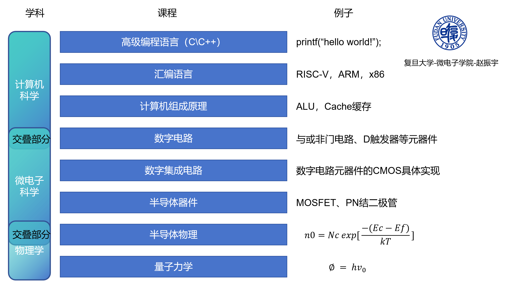

# 数字集成电路实验讲义
# 写在前面
## 为什么写这本讲义
岁月不居，时节如流。转眼我的本科五年时光（还有一年少数民族预科）就要迎来剧终了。

2024年的大三暑假，我参加了“一生一芯”项目。“一生一芯”项目和计算机体系结构密切贴合，这样公益性、高质量的项目，对于一个中学时因热爱DIY装机而选择集成电路专业的我来说，真的非常有吸引力。

但是，在学习的过程中，我也有了一些思考。本科期间专业课程的学习，使得我对芯片的理解比中学时更深刻，我认识到：**设计芯片绝不只是RTL代码**。RTL代码固然重要，但是要想更深入的、全栈式的学习芯片，还是离不开半导体物理与器件、半导体工艺、电路原理等基础学科。而目前（2024 “一生一芯”第7期）的讲义内容中，更加偏向计算机专业的顶层设计，而**缺失了关于底层半导体器件和集成电路的知识**（子濠学长原谅我）。

比如以下几个问题，对于计算机专业的同学可能并不能很好的回答出来：
1. 如何使用晶体管来搭建与，或，非门，D触发器等基本数字电路元器件的呢？
2. 与非门和与门，或非门和或门相比，哪个速度更快？
3. 对于CMOS工艺来说，悬空的引脚应该如何处理？
4. 为什么要避免一个门的输出同时驱动很多门的输入？
5. 芯片发热的原因是什么？
6. 如何降低芯片的功耗？

通过本讲义的学习，相信各位同学一定可以很好的回答上述问题。

现在，关于半导体物理和器件以及集成电路的相关实验教学资料也并不多见，因此，受子濠学长编写PA的启发，我斗胆产生了：自己动手编写一个，面向微电子专业（以及相关专业）同学的**公益性的开源数字集成电路实验讲义**。

我想，这样的一个讲义，既是**对自己本科微电子专业知识的总结和回顾**，也希望能**为我们中国的芯片事业贡献一份绵薄之力**。我认为这是一件非常有意义的事情！如果还可以有幸帮助到更多志同道合的同学，那鄙人不胜感激！

由于本人才疏学浅，尽管我已经尽可能的避免错误，但难免讲义中还会出现一些错误，还请大家海涵，也非常欢迎大家及时指出错误，我们一同交流，共同进步。

路漫漫其修远兮，本讲义系列只是数字集成电路中的冰山一角。数字集成电路中还有很多知识等待着我们去探索，比如：CMOS存储电路，ADC等数模混合集成电路，后端版图设计等等。

如今，我国在芯片领域被美国卡脖子，限制我们中国芯片的发展，希望各位同学们可以一起努力，让我们摆脱如今的局面。这条路很长也很难，但是**雄关漫道真如铁，而今迈步从头越**，让我们为祖国芯片事业贡献力量，为人类芯片前沿做出贡献！

赵振宇

2024年8月31日于南京

## 本讲义的定位
不妨让我们从研究层次的视角出发，重新审视一下计算机与微电子的各个课程，以及这些课程之间的联系。

量子力学的发展，为我们提供了研究微纳尺度下，电子器件的理论基础。当微观粒子足够多，多到满足统计力学的情况下，半导体物理闪亮登场。半导体物理为半导体器件中最基本的PN结提供了理论基础，有了理论的支撑，我们可以开始构造更多微纳尺度下的器件，比如MOSFET。随着半导体工艺的发展，让MOSFET这一器件具有了大规模、大批量生产的优势。计算机科学的发展，让人类对计算的需求急剧增加。而微电子与计算机交叉，让我们人类迈向了集成电路时代。数字集成电路就是讨论如何利用CMOS技术来构造一些基本的数字电路器件。数字电路则更为“抽象”，只是给出了一些基本的数字元器件，例如与或非门以及D触发器，并没有阐述这些基本元器件的实现方法。在有了基本数字元器件后，我们便可以使用这些基本的元器件来构造计算机了，因此，计算机组成原理应运而生。为了让我们避免直接使用机器语言进行指令的编写，汇编语言被发明出来。最后，为了进一步避免程序员与计算机底层打交道，以及便于程序的移植，高级编程语言被发明。

本讲义主要集中于数字集成电路部分，并适当的向上和向下“延伸”一部分，向下会讲解半导体器件中MOSFET的基础知识，向上会讲解计算机组成原理中CPU的基本组成。

## 您将学到什么？
+ 您将使用完全免费、轻量化的电路仿真工具[LTspice](https://www.analog.com/cn/resources/design-tools-and-calculators/ltspice-simulator.html)，学习如何使用最基本的元件——晶体管（CMOS工艺），来亲自动手实现数字集成电路的许多典型电路和模块（例如基本门电路、加法器、D触发器等）。
+ 除了基本电路的实现，您还将学习数字集成电路设计中，如何对性能、功耗以及面积进行综合考虑，进而设计出一个合适的数字集成电路模块。
+ 您将学习数字集成电路设计中常用的优化手段，例如精心设计晶体管尺寸。

## 预估用时
在掌握基本的数字集成电路理论和仿真工具使用方法的情况下，我们预估完成全部实验的用时为：10小时。

## 参考教材
本系列实验的参考教材为《数字集成电路:电路、系统与设计：第二版/（美）Jan M. Rabaey 等著；周润德 等译》。

## 实验环境
操作系统：Windows10及以上
仿真软件：LTspice 版本 24.0.12（2024.08.29更新）

## 项目文件内容
项目文件主要分为2部分：
1. 第一部分为讲义的Markdown文件，还有一些希望大家可以阅读的课外资料。
2. 第二部分为LTspice仿真文件，在LTspice_project文件夹中，其中包括各个章节的对应实验仿真文件以及定义的库文件夹my_lib，直接使用LTspice打开运行即可。

## 实验目录
+ 实验1 晶体管器件基础1——静态特性
+ 实验2 （重要）晶体管器件基础2——MOSFET的宽长比
+ 实验3 晶体管器件基础3——动态特性
+ 实验4 晶体管器件基础4——工艺角与PVT
+ 实验5 CMOS反相器（非门）
+ 实验6 负载的概念
+ 实验7 *反相器链
+ 实验8 *功耗、能量和延时
+ 实验9 CMOS组合逻辑电路设计
+ 实验10 CMOS时序逻辑电路设计
+ 实验11 运算功能模块设计
+ 实验12 硬件描述语言——Verilog

## 学习建议
对于微电子以及电子信息专业同学，希望大家把每一章节的实验全部学习一遍，并且思考其中每一个电路的原理以及思考题。

带*的内容表示，对于计算机等非微电子专业的同学，可以根据自身情况选学。

## 仿真说明
由于本讲义以教学为目的，使用的模型为教材提供的BSIM3模型，**因此仿真结果与实际情况有所差距**，但是并不影响整体教学。如果有条件的话，非常建议同学们使用fab提供的PDK文件在Cadence、华大九天等商用级EDA中进行复现。

## 作者简介 & 联系我
[赵振宇](https://github.com/15947470421)：一位来自内蒙古自治区的蒙K青年~。本科就读于南京航空航天大学集成电路学院微电子专业，目前保送至复旦大学微电子学院攻读博士（祝我自己早日顺利毕业~~~）。博士的研究方向为：光电融合人工智能芯片。

如果您也对这个讲义很感兴趣，希望一同编写，或者对讲义有更好的建议，非常欢迎联系我：15947470421@163.com
