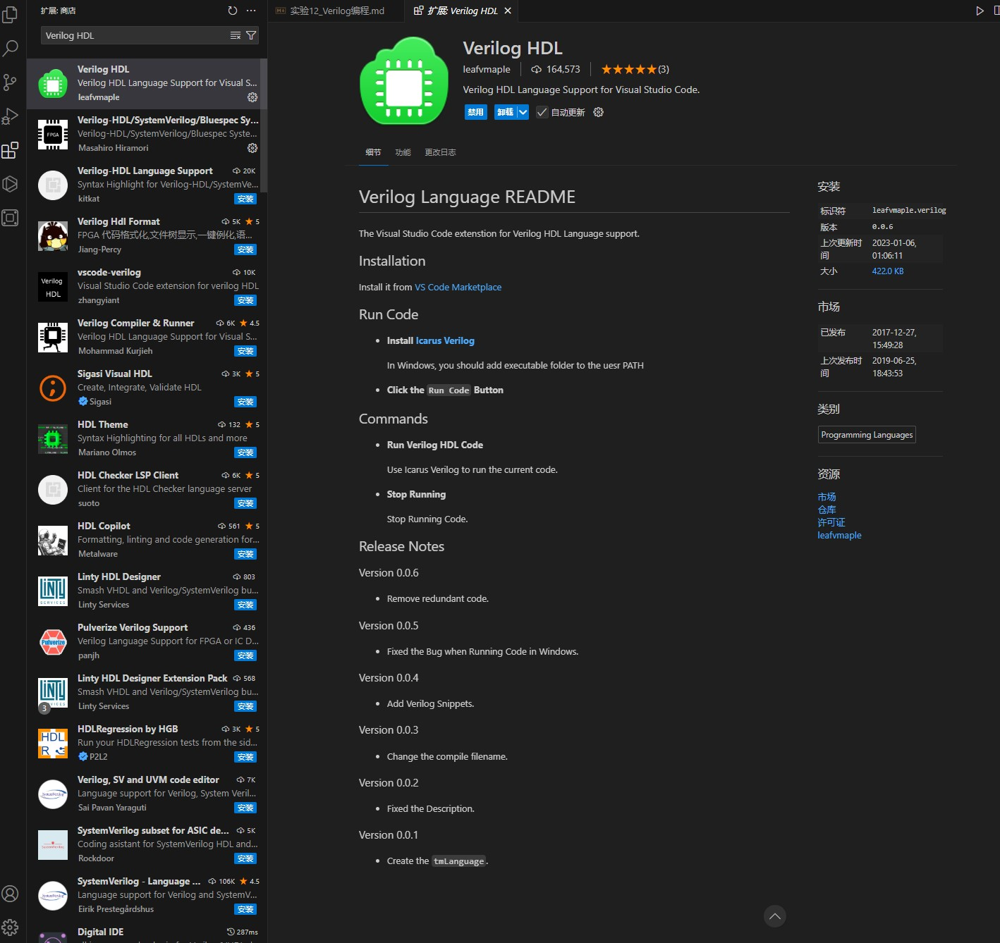
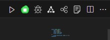
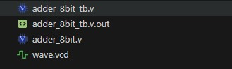
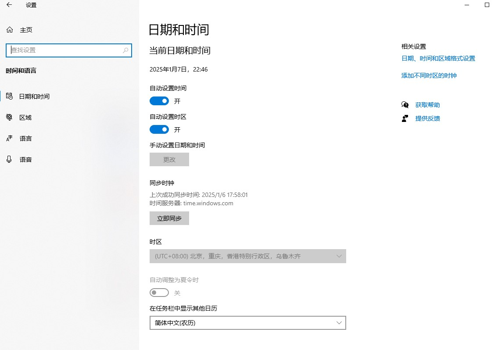
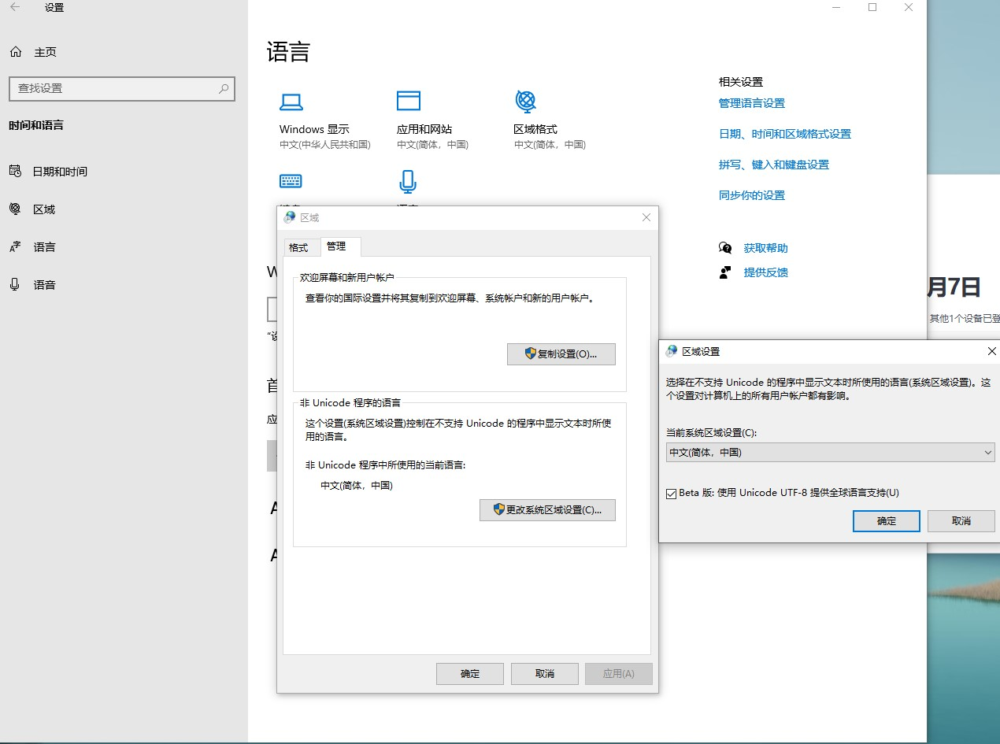
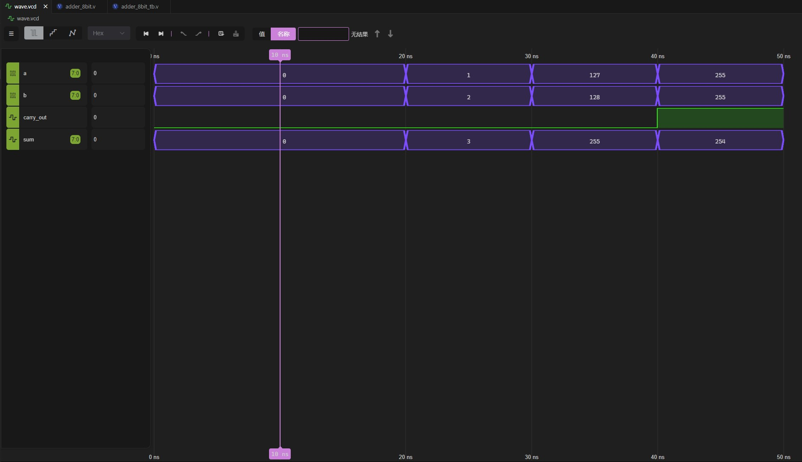
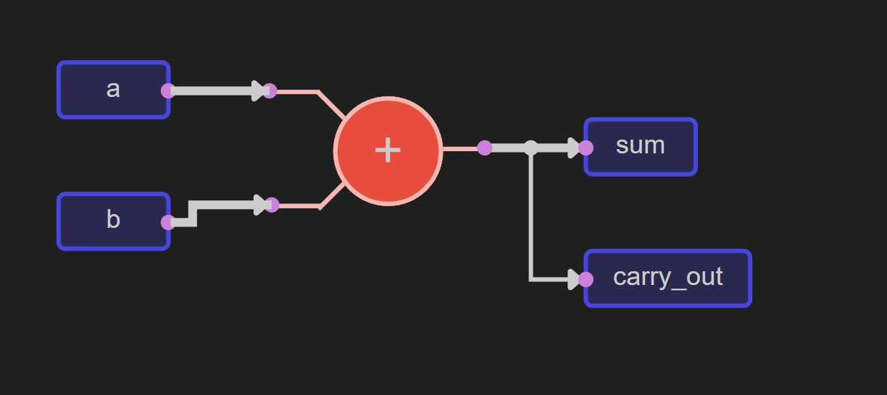

# 实验12 硬件描述语言——Verilog

> “凿井者，起于三寸之坎，以就万仞之深。”
>
> ——《刘子·崇学》，刘昼

通过前面的实验，相信同学们已经体会到如果我们的电路规模很大，我们花费了大量的时间和精力在重复的摆放器件和连接导线。对于一些大规模的工程，显然我们不可能再手动画原理图（比如手动摆放100个与非门）。

而HDL语言就是为了大规模集成电路而产生的。HDL语言并不属于教程的内容，这里默认大家已经掌握的HDL语言（本教程使用Verilog语言），主要讲解环境的搭建。

## 配置轻量化Verilog开发环境

### 安装iverilog
`iverilog`是一个开源的免费编译Verilog代码的工具。用于编译我们编写的Verilog代码。

点击[iverilog的官网](https://bleyer.org/icarus/)下载，选择其中的`iverilog-v11-20210204-x64_setup.exe [44.1MB]`链接进行下载。
**请务必安装v11版本，后续的插件不支持v12版本！**

下载完成后，正常解压和安装。**记得在安装的过程中将iverilog添加到系统变量中。**

### 安装VScode插件`Verilog HDL`
`Verilog HDL`是在VScode中一键运行Verilog代码的插件。

???+ info "Verilog HDL插件"
    

在VScode的拓展中搜索并安装即可使用。

安装完成后，会在打开Verilog文档的时候，VScode界面的右上角有一个绿色的按钮，这个按钮可以调用iverilog并编译和运行当前的Verilog代码。

???+ info "Verilog HDL右上角按钮"
    

### 安装VScode`Digital IDE`
`Digital IDE`（以下简称DIDE）是一款开源的免费的数字开发集成开发环境，可以让我们的Verilog编程体验大幅提升。它由NC-AI团队开发。[该项目的github主页](https://github.com/Digital-EDA/Digital-IDE)，同学们如果觉得好用，也欢迎大家为该项目star。

???+ info "Digital IDE插件"
    

我个人比较喜欢和常用的功能包括：
1. 电路综合：内部集成了yosys，使用yosys综合电路，并且内置了Netlist查看器。
2. vcd波形查看器：DIDE团队自行开发了一款非常“炫酷”的vcd波形查看器，效果非常好！
3. 模块文档化：可以自动生成模块的描述文档。

DIDE的快速上手教程可以参考[DIDE的官网](http://nc-ai.cn/)。

## 编程初体验
搭建好环境后，我们便可以开始愉快的编程之旅了。我们这里仅使用一段最基础的加法器作为实例演示。

### 编写代码和testbench
首先，我们在工程文件夹下新建一个.v文件（.v是Verilog文件的后缀名）命名为adder_8bit.v，并编写Verilog代码。这里直接给出加法器代码：
```
module adder_8bit(
    input [7:0] a,
    input [7:0] b,
    output [7:0] sum,
    output carry_out
);
    assign {carry_out, sum} = a + b;
endmodule
```

然后我们在同一个文件夹下再新建一个Verilog文件，并命名为adder_8bit_tb.v，该文件是加法器的testbench文件，对应的testbench代码如下：
```
`include "adder_8bit.v" // 包含源文件
`timescale 1ns / 1ps

module adder_8bit_tb;
    reg [7:0] a;
    reg [7:0] b;
    wire [7:0] sum;
    wire carry_out;

    // 实例化待测试的8位加法器模块
    adder_8bit uut(
        .a(a),
        .b(b),
        .sum(sum),
        .carry_out(carry_out)
    );

    initial begin
        // 初始化输入
        a = 8'b0;
        b = 8'b0;

        // 测试用例1: 0 + 0
        #10;
        a = 8'b0;
        b = 8'b0;

        // 测试用例2: 1 + 2
        #10;
        a = 8'b00000001;
        b = 8'b00000010;

        // 测试用例3: 127 + 128
        #10;
        a = 8'b01111111;
        b = 8'b10000000;

        // 测试用例4: 255 + 255
        #10;
        a = 8'b11111111;
        b = 8'b11111111;

        // 测试完成，结束仿真
        #10;
        $finish;
    end

    initial begin
        $display("start a clock pulse");    // 打印开始标记
        $dumpfile("wave.vcd");              // 指定记录模拟波形的文件
        $dumpvars(0, adder_8bit_tb);        // 指定记录的模块层级
        #100 $finish;                       // 100个单位时间后结束模拟
    end
endmodule
```

这里需要说明一下以下6行代码的作用，以及如何在其他工程中调用：
```
initial begin
    $display("start a clock pulse");    // 打印开始标记
    $dumpfile("wave.vcd");              // 指定记录模拟波形的文件
    $dumpvars(0, adder_8bit_tb);        // 指定记录的模块层级
    #100 $finish;                       // 100个单位时间后结束模拟
end
```
这6行代码的作用就是指定输出的波形文件以及指定需要仿真的模块。每次在其他工程中调用的时候，需要将`$dumpvars(0, adder_8bit_tb);`中的`adder_8bit_tb`更改为对应的testbench模块，并且将`#100 $finish;`结束时间根据具体工程进行调整。

然后我们点击右上角的Verilog HDL的绿色按钮，即可一键进行仿真了。如果不出意外的话，就会看到文件夹中多出了2个文件：
1. `adder_8bit_tb.v.out`：这个文件是输出的记录文件。
2. `wave.vcd`：这个文件是生成的波形文件，也就是我们需要查看的结果。

???+ info "最终的文件夹目录"
    

### Windows系统下iverilog运行报错
如果同学使用的是Windows系统，那么此时会报错，输出一段乱码（请不要将这段乱码复制在文档中，“它”会像病毒一样，导致整个文档的编码都变成乱码，别问我怎么知道的...）：

???+ info "输出乱码"
    

请按照如下步骤修改设置：
1. 打开电脑`设置`
2. 打开`时间和语言`选项

???+ info "日期与时间"
    

3. 选择`语言`
4. 在右边部分的相关设置中`管理语言设置`
5. 在非Unicode程序的语言框，点击`更改系统区域设置`
6. 在弹出的对话框中的最下方，点击`Beta版：使用Unicode UTF-8 提供全球语言支持(U)`打勾，然后重新启动电脑。

???+ info "勾选Beta版本"
    

重启后，应该就不会报错了。

### 查看仿真波形
DIDE可以直接打开.vcd波形文件，打开后可以查看输出的波形（DIDE的操作请查看DIDE的操作说明）。

???+ info "波形输出文件"
    

这里可以看到，8bits加法器的输出完全正确。

### 使用yosys进行综合
DIDE还集成了yosys这一开源电路综合工具，帮助我们生成综合之后的网表文件Netlist。点击右上角的Netlist图标，DIDE就会自动调用yosys综合电路。最终综合之后的电路如下：

???+ info "查看综合后的Netlist"
    