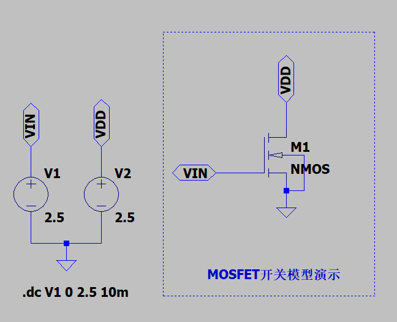
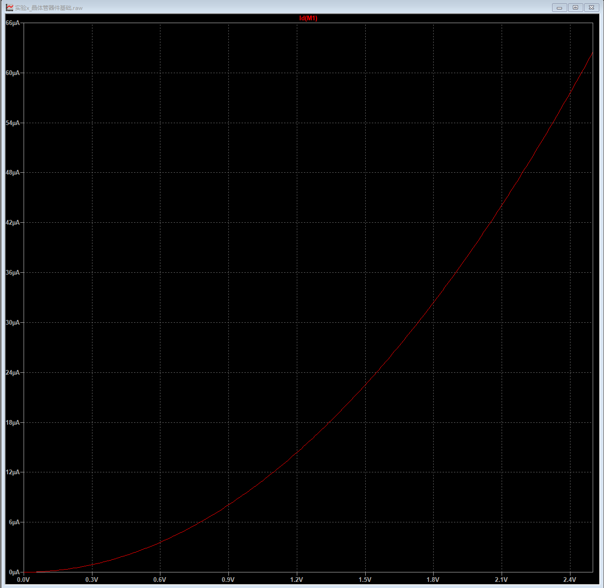
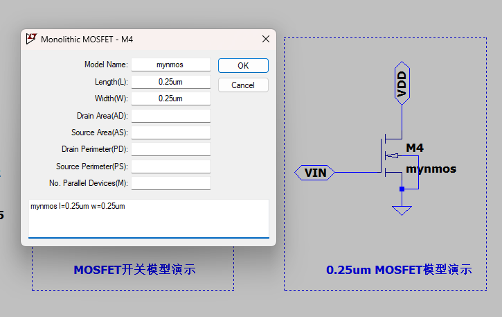
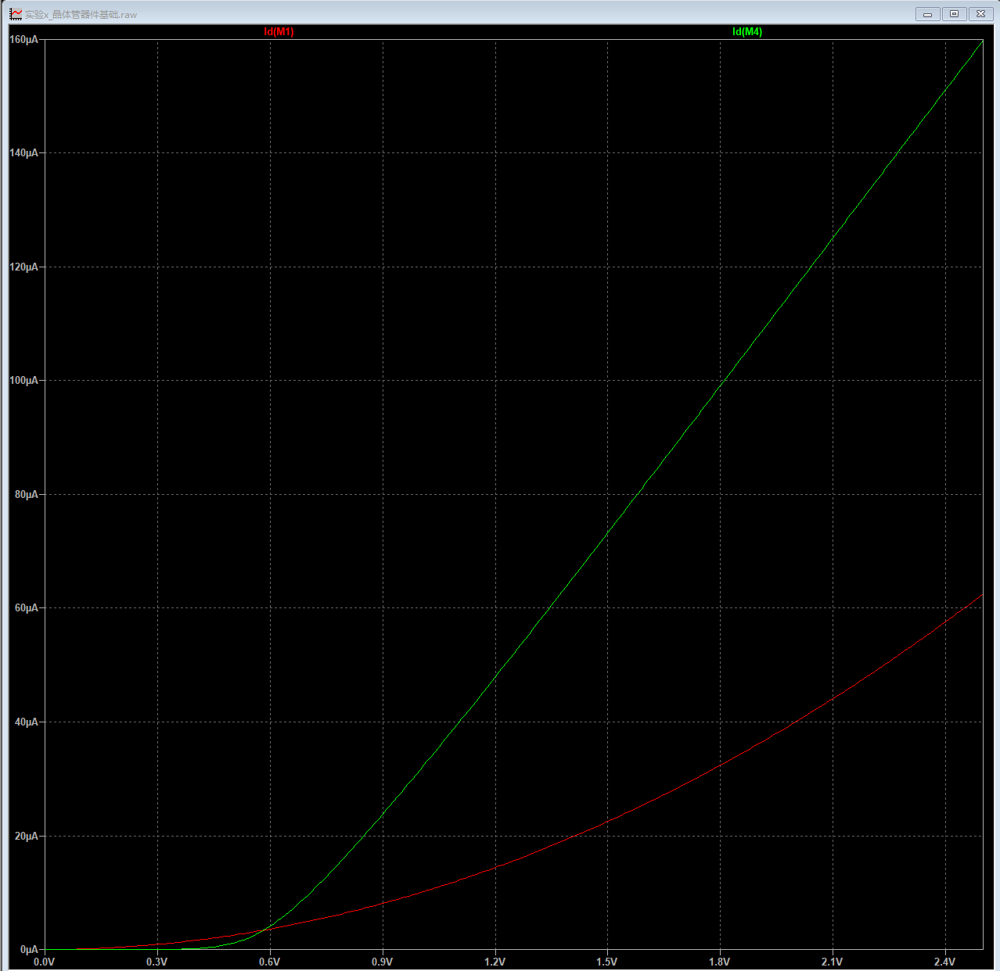
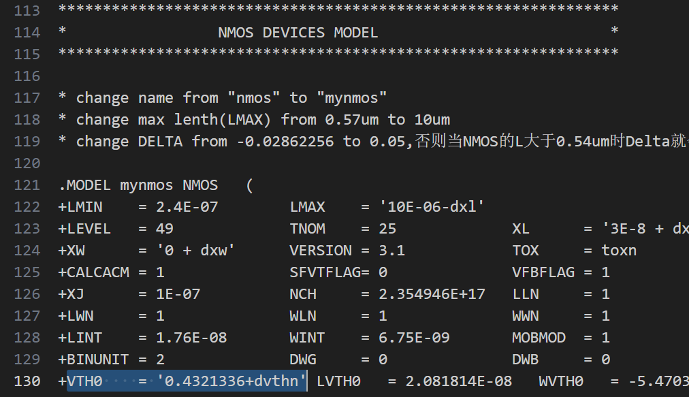
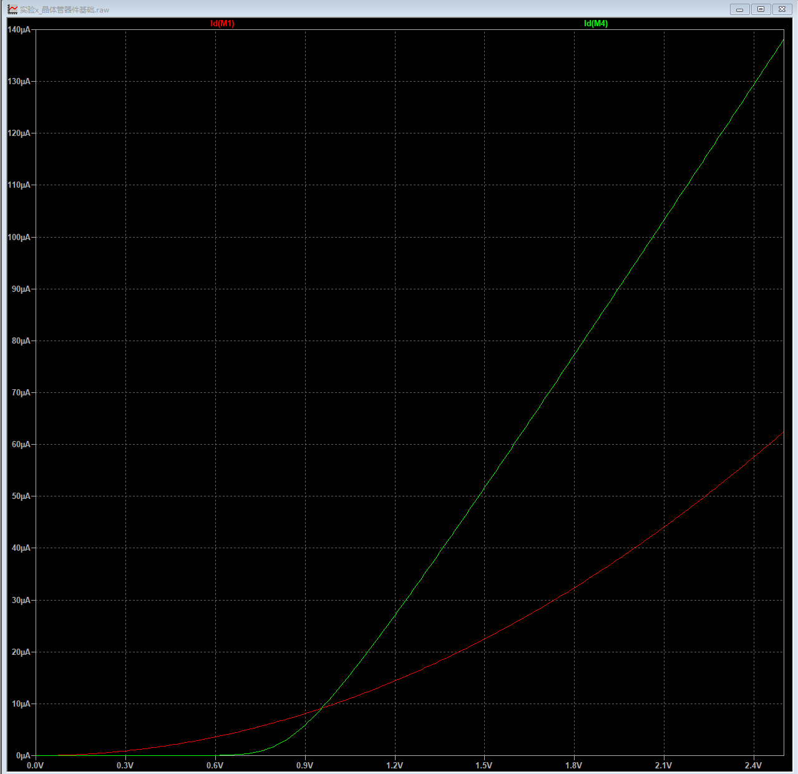
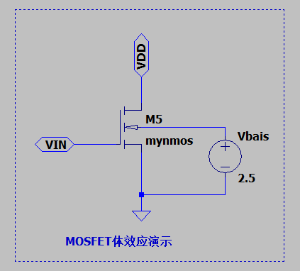
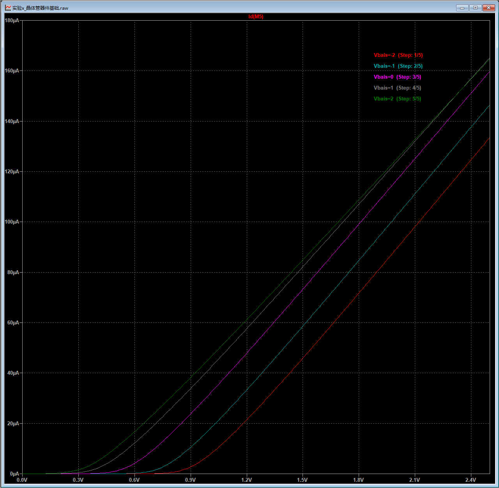
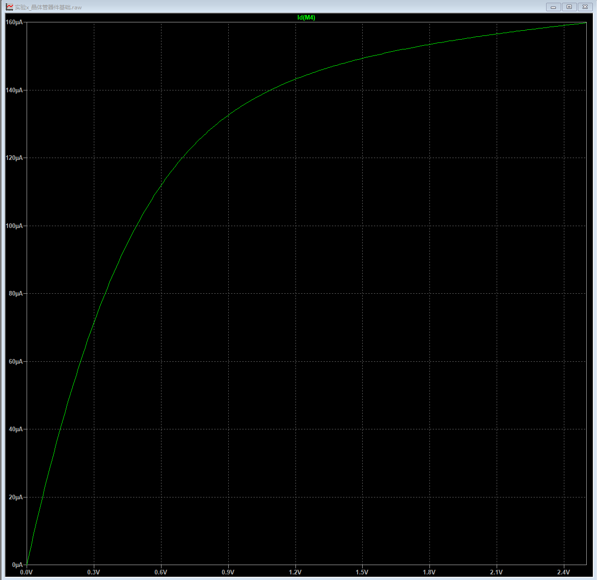

# 晶体管器件基础1——静态特性

> “x'x'x'xxxxx”
>
> ——x'x'x'xxxxx

金属-半导体-氧化物场效应晶体管（MOSFET）是构建集成电路的最基本器件，是信息时代的基石。正如一个优秀的建筑工程师需要对混凝土的特性烂熟于心才能盖好一座摩天大楼，一个优秀的芯片工程师，也应该对最基本的器件——晶体管的特性有一定的了解。

## 晶体管简介
首先，让我们从静态特性来分析MOSFET。关于MOSFET的基本原理，构造以及相关知识，可以在任何一本半导体物理与器件的书籍中找到，我们这里不再过多阐述，我们主要关注如何通过实验来验证我们学过的理论。

这里我们推荐一个优秀的MOSFET原理简介视频，没有学过半导体物理与器件的同学可以简单了解。[【Mos管的工作原理】](https://www.bilibili.com/video/BV1344y167qm?vd_source=aa85303f1dbb0801d8c8b1ab5be44e98)

**请注意，虽然绝大部分时候，MOSFET被当作一个三端口器件，但是对于我们ICer，要清楚的明白，MOSFET其实是一个四端口器件！**

自行思考：通过上面的视频想一想，为什么一般情况下MOSFET被当作三端口器件呢？

## 最简单的MOSFET模型——开关模型
最简单的MOSFET模型就是“开关模型”，也就是说，将MOSFET看作一个电子开关。以水管为例，栅极就像是水龙头，控制着水管的导通和关断，源极和漏极之间就是水管。当栅极（G）的电压高于阈值电压（VTH）时（水龙头打开），晶体管形成沟道，源级（S）和漏级（D）导通（水管导通）。

我们通过一个NMOS来进行实验，LTspice中默认的NMOS阈值电压为0V（参考LTspice help文档中M. MOSFET章节），我们设定漏极和源极之间的电压为2.5V。通过仿真工具的DC扫描方法，将NMOS的栅极电压从0V增加到2.5V，观察漏极的电流。

最终结果如下：
???+ info"MOSFET开关模型演示电路图"
    

???+ info"MOSFET开关模型演示结果"
    

输出的结果很有意思：虽然阈值电压是0V，但是当栅极电压刚刚超过0V时，输出电流并不是阶梯状的直接升高，而是一个连续上升的过程。因此，在数字集成电路设计中，为了确保MOSFET完全关断/导通，我们一般会让栅极电压要么为0V（关断），要么为VDD（导通）。

> 为什么工作电压VDD取2.5V？

每一个集成电路工艺节点都有对应的工作电压，一般来说，随着MOSFET沟道长度的缩小，工作电压也随之减小。下面我们给出几个典型工艺节点与对应的工作电压：

|工艺节点| 0.25um | 0.18um | 90nm | 45nm | 22nm | 14nm | 7nm | 5nm |
|------ | ------ | ------ |----- |----- |----- |----- | --- |---- |
|工作电压|  2.5V  | 1.8V   |

观察表格我们发现，在0.25um到22nm工艺节点之间，工作电压随着工艺节点的缩小而减小，但是22nm以后，即使工艺节点降低，工作电压降低的速率放缓了。这意味着通过先进工艺降低功耗的办法行不通了！

## 使用更加准确的MOSFET模型
虽然我们成功的仿真了将MOSFET作为一个电子开关，但是我们不禁想问几个问题：1）这个仿真结果准确吗？2）我们使用的晶体管的工艺是什么工艺节点呢？

关于LTspice中的MOSFET模型，请大家自行RTFM，点击LTspice的help，大家可以找到MOSFET的相关描述。通过阅读手册（.OPTIONS — Set Simulator Options章节）我们得知：在默认情况下，LTspice会调用MOS1模型（`There are seven monolithic MOSFET device models. The model parameter LEVEL specifies the model to be used. The default level is one.`）。默认的晶体管沟道长度L和宽度W均为100um（也就是工艺节点是100um）。

这对于我们来说是十分不友好的。首先，默认的MOS1模型过于理想与简单，并没有考虑很多的实际效应。

其次，因为目前绝大部分的工艺已经是深亚微米（沟道长度小于1um），先进工艺的等效沟道长度（**并非实际沟道长度**）已经达到5nm，3nm甚至1nm以下（例如GAA工艺），100um的工艺对于我们来说有些过于“落后”了。

因此，我们这里使用教材提供的0.25um CMOS工艺模型，大家可以通过访问教材的配套网址（http://icbook.eecs.berkeley.edu）进行下载，同时我也在工程文件夹\mylib中存放了，文件为：cmos25_level49.lib。

这里我们对原始工艺模型文件进行了3个改变：
+ 将NMOS和PMOS的模型分别命名为mynmos和mypmos，以和原始NMOS，PMOS模型进行区别
+ 将最大晶体管长度LMAX参数设置为'10E-06-dxl'，原始LMAX仅为0.5um过小
+ 为了防止当NMOS的L较大时参数Delta小于0报错，将DELTA参数设置为0.05

通过在原理图界面添加如下SPICE命令引用我们的模型（*表示注释）：
```
* 引入教材给出的0.25um的MOSFET模型
* 注意：请务必给出MOS的长和宽，否则默认值为100um
* 因为我们在LTspice的设置中添加了地址，所以这里可以直接找到
.lib 'cmos25_level49.lib' TT
```
> 为什么最后有一个TT呢？

在下一节中，我们将会讲解工艺角。

这里，我们使用mynmos模型再次进行仿真。注意，请务必先右键点击mynmos设置沟道长度和沟道宽度，这里我们均设置为0.25um，其他参数保持默认空白。设置完成后界面如下：

???+ info "0.25um MOSFET参数设置界面"
    

我们同时展示了默认的MOS1模型和我们使用的0.25um的MOSFET模型。
???+ info "0.25um MOSFET模型仿真结果"
    

可以看到，这个仿真结果和默认的NMOS模型相差非常大！

## 阈值电压
> 同学们在这里应该会有一个疑问：“阈值电压是多少呢，是否可以更改呢？”

让我们查看我们的0.25um晶体管SPICE模型文件cmos25_level49.lib，文件中包含了几百个参数。其中阈值电压是由参数$V_{TH0}$来定义的，我们将$V_{TH0}$设置为0.7V，再次运行查看结果，结果中的曲线明显向右移动了，说明阈值电压从原始的0.432V变为了0.7V：




虽然我们在仿真的时候，可以通过设置$V_{TH0}$来改变阈值电压，但是本质上$V_{TH0}$是一个与半导体掺杂、栅氧化层厚度等工艺参数相关的参数。在现实中，芯片制作完成后，我们就无法改变这个参数。

## 衬底偏置效应（体效应）
> 是否可以通过其他方法来改变阈值电压呢？

好问题！抛开公式，先让我们自己来思考一下。MOSFET的基本原理是（以NMOS为例）：通过在栅极（G）施加一个正电压，通过栅极和衬底之间的电势差（VGB），将衬底（B）中（以及重掺杂的n+源区中）的载流子（NMOS为电子）吸引到源极和漏极之间，进而形成沟道。

现在，我们假设衬底（B）的电压降低了，那么是不是意味着需要更大的栅极电压才能将衬底（B）中的少数载流子，吸引到源极和漏极之间，形成沟道呢？也就是说：阈值电压变大了，反之亦然。

有了上面直观的理解，让我们将半导体物理与器件中MOSFET的阈值电压表达式写出来：

$V_{TH} = V_{TH0} + \gamma(\sqrt{|(-2)\phi_F + V_{SB}|} - \sqrt{|2\phi_F|})$

别害怕！我知道对于大部分和我一样物理不好的同学，看到这么长的物理公式，都会心生畏惧。我们只需要定性的了解该公式即可。首先给出公式中每一个参数的意义。

1. $V_{TH0}$：当$V_{BS} = 0V$时的阈值电压。
2. $\gamma$：衬底偏置效应系数，反映出$V_{BS}$对阈值电压的影响程度。典型值为0.4。
3. $\phi_F$：费米势，对于p型硅衬底（NMOS），典型值为-0.3V。
4. $V_{SB}$：源极和衬底之间的偏置电压。

显然，当源极和衬底之间没有偏置电压（直接短接在一起）时：$V_{SB} = 0V$，公式中第二部分直接等于0，所以$V_{TH} = V_{TH0}$。

当衬底电压小于源极电压时（$V_{BS} < 0V \Rightarrow V_{SB} > 0V$）：第一个根号中均为正数，第一个根号大于第二个根号，公式第二部分大于0，因此阈值电压增加。（也就是上面直观理解的例子）

当衬底电压大于源极电压时（$V_{BS} > 0V \Rightarrow V_{SB} < 0V$）：第一个根号中一个为正数，一个为负数，第一个根号小于第二个根号，公式第二部分小于0，因此阈值电压减小。

总结为一句话版本就是：“增大衬底对源极的偏置电压，阈值减小；减小衬底对源极的偏置电压，阈值增大。”

下面我们通过参数扫描的方法来进行实验，我们将之前的电路图中的MOSFET的衬底引脚不再直接与源极短接，而是增加一个偏置电压V_bais，我们分别取衬底对源极的偏置电压为-2V，-1V，0V，1V和2V。
???+ info "体效应演示电路图"
    

???+ info "体效应演示结果"
    

结果表明，当偏置电压升高时，阈值电压降低。由于衬底（B）的电压不同，进而导致阈值电压也随之改变的效应被称作衬底偏置效应或者体效应。

体效应的实际应用：Intel公司的处理器实现高性能/低功耗模式的动态调节技术就是通过体效应来实现的。当处理器在高性能模式时，就将阈值电压降低，阈值电压降低电流提高，进而提升性能；当处理器在低功耗模式时，就将阈值电压提高，电流降低，进而降低功耗。

注意：由于在大部分的集成电路制造工艺中，使用单阱工艺，NMOS的源极一般都连接到GND，而NMOS的p型衬底就是晶圆，也为GND，所以NMOS一般不考虑体效应。但是PMOS则是在P型衬底晶圆上通过一个N阱作为衬底，因此PMOS的衬底电压是可以由我们来决定的，所以PMOS一般会考虑体效应。不过在双阱工艺中，NMOS和PMOS都有体效应。（看不懂的同学请复习一下半导体工艺技术~~~）

## 晶体管电压-电流关系
让我们再次用水管的例子进行类比。水管中的水流大小（晶体管的漏极电流大小）主要取决于两点：1. 水龙头的开关大小（栅极电压$V_{GS}$），2. 水管两端的水压大小（漏极和源极之间的电压$V_{DS}$）。

我们已经讨论了在$V_{DS}$固定的情况下，栅极电压$V_{GS}$和阈值电压$V_{TH}$对输出电流的影响。接下来，我们将栅极电压$V_{GS}$固定为2.5V，再将$V_{DS}$从0V增加到2.5V。类似于固定水龙头开关的情况下，改变水管两端的水压。结果如下：

???+ info "晶体管VDS扫描结果"
    

这个结果很有意思：一开始，随着漏极和源极之间的电压$V_{DS}$增加，电流也随之增加，但是当$V_{DS}$增加到一定值后，电流就出现“饱和”的现象了。

### 长沟道器件的饱和
饱和现象的产生有两种原理，第1种主要发生在长沟道器件（沟道长度L大于1um）中。简单来讲就是，当漏极电压逐渐升高，靠近漏极附近的沟道部分的电势升高，栅极电压不再满足大于阈值电压的条件，使得漏极附近的沟道发生了“夹断”现象。此时，电流趋于饱和。

### 短沟道器件的速度饱和
第2种原理称为速度饱和，通常发生在短沟道器件（沟道长度L小于1um）中，也更加易于直观理解。随着$V_{DS}$电压的增加，沟道两端的电场强度不断增加，当沟道电场达到某一个临界值时，沟道中载流子的速度将由于散射效应（载流子间的碰撞）而趋于饱和。

这就有点类似于，当我们不断的增加水管两端的水压，在水压大于某一个临界值后，由于水管中的水分子互相挤压，难以再提高水流大小。

## 从电阻角度看待晶体管
电阻分压模型是我们初中学习物理的时候就非常熟悉的模型。“越简单越有效”。现在，让我们从这一简单直观的模型出发，再次思考一下MOSFET的各个现象。

我们先考虑栅极电压VGS固定，VDS变化的情况，这就类似于变化电阻两端的电压。

对于一个理想电阻，流过电阻的电流随着两端电压的升高而升高。对于MOSFET来说，一开始的曲线确实如此，说明在VDS较低时，MOSFET的电气特性与电阻相似。

但是当VDS逐渐增加，电压对电流的导数（电阻）逐渐增加（注意，图中的横轴时电压，所以需要先将图像的坐标轴互换再求导数），这说明此时MOSFET的电气特性类似于一个随两端电压VDS增加而增加的可变电阻。

最后考虑VDS固定，栅极电压VGS变化的情况。这个情况比较简单，当栅极电压VGS小于阈值电压VTH0时，沟道没有形成，电阻非常大。当栅极电压VGS大于阈值电压VTH0时，沟道形成，电阻减小。

上面的分析可以让我们得到MOSFET的3个工作区域：
1. 截止区
2. 线性电阻区
3. 饱和区

用水管的例子来说明：截止区就类似于水龙头关闭，水管中没有水流。线性电阻区就是已经打开了水龙头，随着水管两端的水压增大，水管中的水流也增大。饱和区就是当水管两端的水压不断增大，水管中的水由于互相挤压，水流很难增大，趋于饱和。

## 课后练习
1. 尝试整理这一节中讲解过的影响晶体管电流的因素有哪些？
2. 右键点击晶体管符号，自行查阅弹出的窗口中，各个参数的含义(L,W,AD,AS,PD,PS)。
