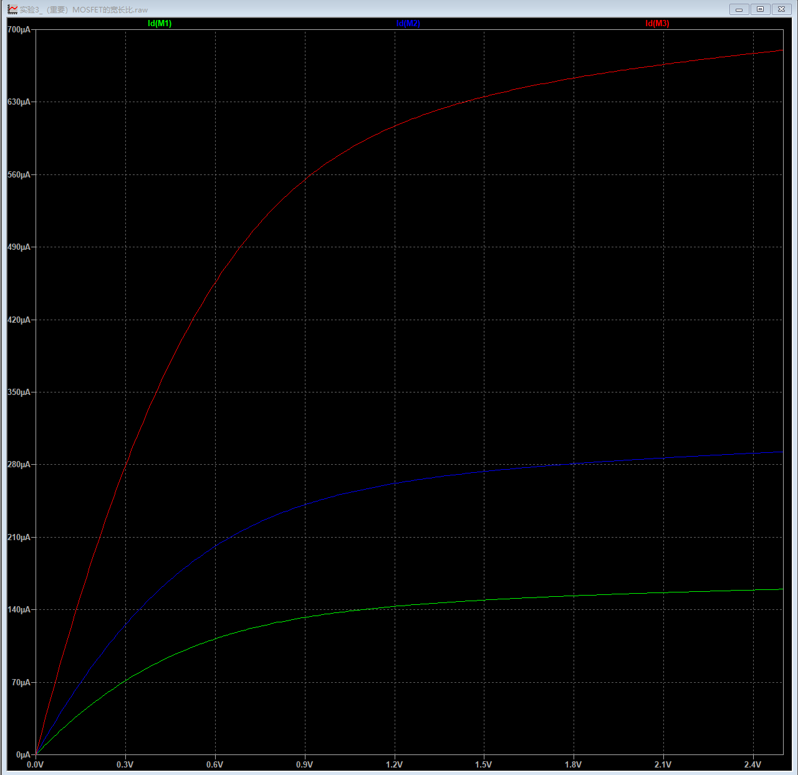
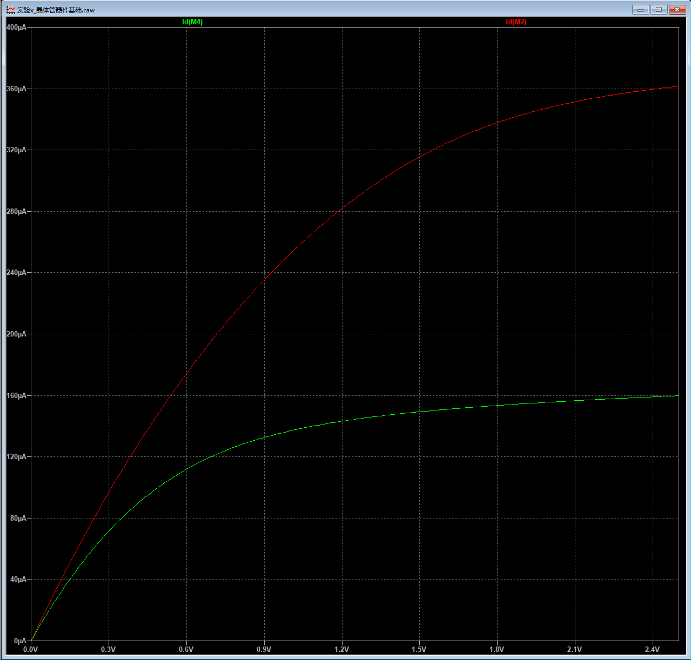

# 实验2_（重要）晶体管器件基础2——MOSFET的宽长比
> “他尽力两手挝过道：“忒粗忒长些！再短细些方可用。”说毕，那宝贝就短了几尺，细了一围。悟空又颠一颠道：“再细些更好！”那宝贝真个又细了几分。悟空十分欢喜，拿出海藏看时，原来两头是两个金箍，中间乃一段乌铁；紧挨箍有镌成的一行字，唤做“如意金箍棒”，重一万三千五百斤。”
>
> ——《西游记》，吴承恩

在上一节中，我们介绍了晶体管的基本静态特性。这一节，让我们来学习一个对于集成电路设计师最重要的概念——MOSFET的宽长比（又称作MOSFET的尺寸）。

## 再回首，MOSFET的结构
如果将MOSFET的沟道类比于水管，我们可以通过让水管的直径更粗来流过更多的水流。那么是否可以通过将沟道的横截面积做的更大，从而流过更多的电流呢？用初中物理的知识来理解就是：**电阻的横截面积越大，电阻越小**。

通过图1的MOSFET结构图，我们可以看到，实际上导电沟道是一个长方体（不考虑沟道长度调制效应等的理想情况），其长度就是图中的L，宽度就是图中的W。

如果我们将W增加，就相当于增加了沟道的横截面积，那沟道的等效阻值就应该减小。

???+ info "MOSFET物理结构示意图"
    

> 问题时间：有些同学可能会问：“为什么我们不可以增加沟道的高度（厚度）？也相当于增加了横截面积。”

这是因为沟道的厚度是由制造工艺决定的，我们电路设计师是无法改变的，我们只能改变晶体管的宽度W和长度L。

由此可见，在沟道长度L不变的情况下，当我们增加晶体管的宽度W，增加了晶体管的W/L（晶体管的尺寸），进而减小了沟道等效电阻。这表明在相同的驱动电压下，晶体管中的电流增加了。

## 改变MOSFET的W/L
我们固定栅极电压VGS为2.5V，漏极电压VDS从0V增加至2.5V，我们分别将晶体管的W/L设置为1，2，5（L均为0.25um，W分别为0.25um，0.5um,1.25um），观察输出的漏极电流结果。

实验结果如下：

???+ info "晶体管尺寸对电流的影响"
    

可以看到，随着我们增加晶体管的尺寸，输出电流随之增加。

> 问题时间：增加电流有什么好处？

很好的问题。接下来的章节，我们会看到增加电流代表电路的驱动负载能力增加，也就表示可以提高电路的运行速度。

> 问题时间：那我们是否可以为了追求极致的性能，而无限制的增加晶体管尺寸呢？

虽然我们已经看到了增加W/L可以大幅改善驱动能力，可惜天下没有免费的午餐，增大W/L也带来的一些问题。
1. **芯片的成本与芯片的面积成4次方关系**，那么如果我们把每一个晶体管的尺寸（宽长比）都增大5倍，那么意味着芯片的成本会增加625倍！显然，你的老板不会接受这样的情况。
2. **过大的电流意味着功耗的急剧增加！**你肯定不希望你的手机在玩王者荣耀的时候像刚出锅的红薯一样烫手吧！
3. **从制造工艺的角度出发，W/L不可能无限制的增加。**这是因为晶体管的宽度W存在一个最大值（由每个工厂的工艺决定，例如中芯国际180nm工艺W最大为10um），长度L存在最小值（一般就是这个工艺节点的特征尺寸，例如0.25um工艺的L最小就为0.25um）。

## 误区：在相同VDS条件下，只要宽长比W/L相同，晶体管的电流一定相同

为了验证上述结论是错误的，让我们设计一个实验。我们比较所有条件均相同，宽长比均为1的两个NMOS，唯一的区别是：第一个晶体管的W=L=0.25um；第二个晶体管的W=L=1um。

最终结果如下：
???+ info"宽长比相同的对比"
    

其中绿色的曲线是第一个晶体管（W=L=0.25um）的电流，红色的曲线是第二个晶体管（W=L=1um）的电流。很明显，即使在宽长比均为1的情况下，两个晶体管的电流还是差距很大！为什么？

还记得上一结讲过的饱和的两种方式吗？一种是长沟道器件的，一种是短沟道器件的速度饱和。显然，对于0.25um的晶体管，其饱和原理是速度饱和，发生速度饱和时的VDS电压比正常饱和发生时的VDS电压更低，也就是说对于短沟道器件，当VDS较低时就已经进入饱和区了。因此短沟道器件的饱和电流更低。

## 故事时间：FinFET与胡正明
当工艺节点不断下降，栅极对沟道的控制能力越来越弱，这就像一个水管，随着阀门越来越小，其对水流的控制能力也越来越小。宏观的表现就是，MOSFET已经不受我们控制了，以NMOS为例，即使我们的栅极电压为0V（或者很低），依旧有电流通过！在工艺节点来到22nm时，人们发现平面工艺无论如何优化也难以突破22nm的大关。这时，加州大学伯克利分校的华人科学家胡正明（1947年7月12日出生于中国北京，微电子学家，美国国家工程院院士、中国科学院外籍院士，美国加州大学伯克利分校杰出讲座教授）在1999年提出：“如果我们让栅极不只是放在沟道上面，而是三面环绕包裹沟道，那么栅极对沟道的控制能力就会大大增加。”因为这种结构的沟道长得很像鲨鱼背鳍（Fin），因此也被称为FinFET晶体管。也得益于胡教授的发明，摩尔定律得以延续。请大家想一想，如今来到7nm，5nm甚至3nm节点，FinFET也难以满足我们的需求，我们又该如何做呢？请大家自行搜索先进工艺相关内容。

## 课后练习
1. 通过设置一个NMOS的尺寸，使得其在导通状态下的电阻为10k欧姆。（VDS=2.5V，VGS=2.5V，L=0.25um）
2. 在NMOS的漏极与电源VDD中间串联一个阻值为10k的电阻。通过调整NMOS的尺寸，使得在NMOS处于导通状态时，中间节点的输出电压约等于1V。（并从电阻角度解释为什么）