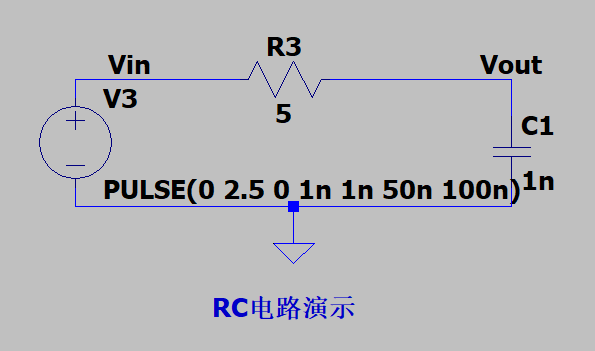
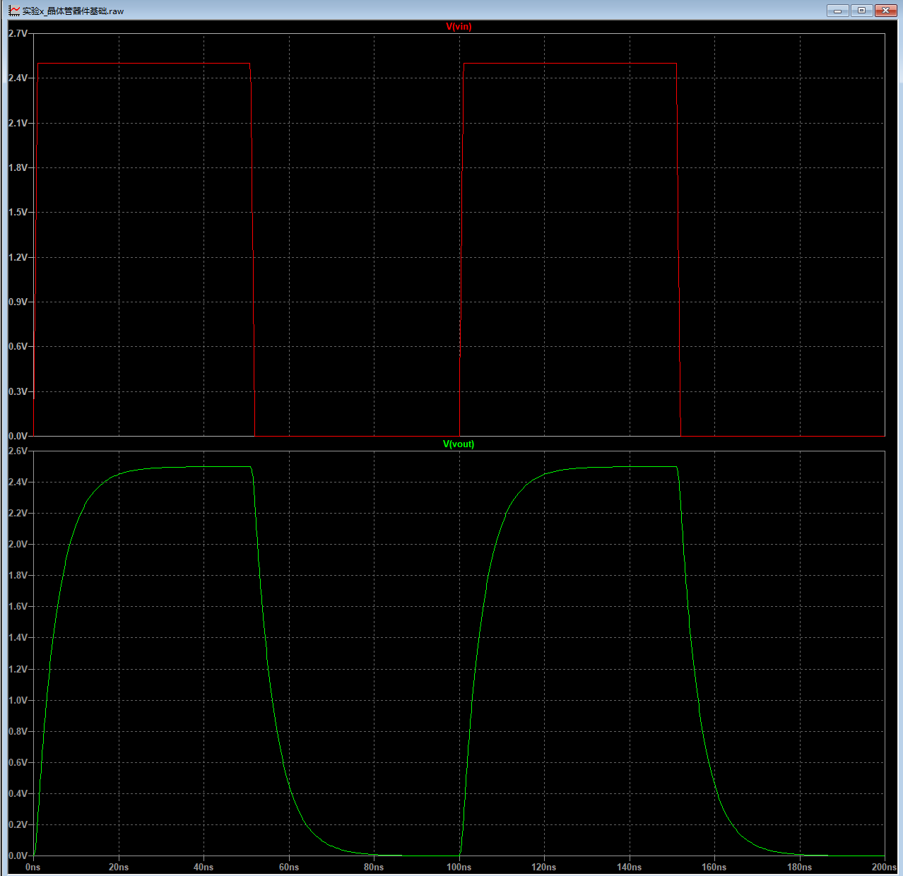
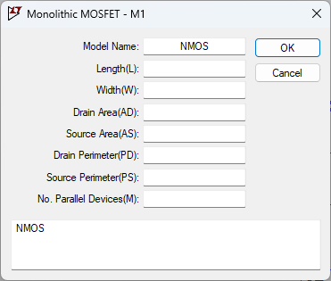
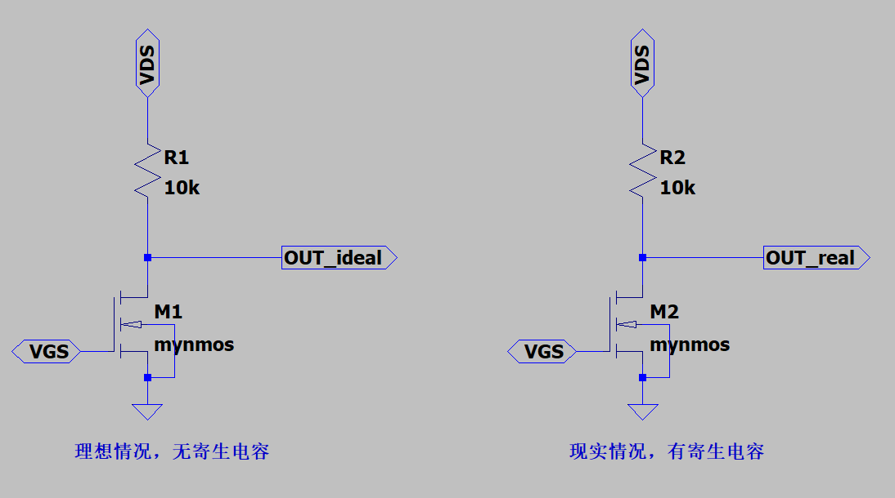
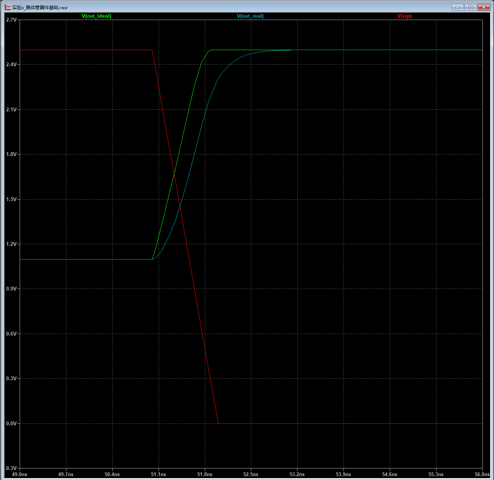

# 实验3_晶体管器件基础3——动态特性

> “一切变化，都是值得思考的奇迹，每一刹那发生的事都可以是奇迹。”
>
> ——《瓦尔登湖·经济篇》，梭罗

前面的分析我们都是假设输入的信号即**栅极电压VGS不变**，然后**观察晶体管的输出电流**，但是在实际的情况中，输入信号会不断的变化，而且随着现在CPU主频越来越高，晶体管的动态特性越来越重要。下面让我们来走进“动态的世界”。

动态特性需要让电路“动起来”，也就是**输入信号电压不断改变**，同时观察**晶体管的输出电压**。所以我们使用上一个实验中，课后作业的电阻和晶体管串联的电路结构来进行接下来的实验。

## RC电路回顾
所有电路中的延迟效应都可以归结于RC模型，所以让我们通过下面的实验先来简单复习一下RC电路的基本概念。

???+ info"RC电路演示电路图"
    

???+ info"RC电路演示结果"
    

对于结果的分析，让我们从三个角度出发理解：

1. 从电压时域角度理解，RC电路相当于一个将输入延迟了一段时间再输出，时域波形变得平滑了。这个延迟时间由时间常数$\tau=RC$决定。（如果这个都不理解的话，请同学赶紧复习一下电路分析吧！/remake）

2. 从电压频域角度理解，RC电路相当于一个低通滤波器，将输入信号中的高频交流分量滤去，低频交流分量通过。其中截止频率$f=1/\tau=1/RC$决定了滤去的高频分离大小。（如果看不懂，请及时复习信号与系统！）

3. 从电流的角度理解，RC电路相当于给负载电容充电，而电阻的大小决定了充电电流的大小。所以电阻越大，充电电流越小，充电时间越长。

由于电容的定义很简单，就是两个极板和中间的介质。所以理论上来说，任意两个平面之间都存在一个寄生电容。

而MOSFET中也有很多平面，这些平面势必会产生很多寄生电容，接下来让我们根据MOSFET的结构来逐一的分析每种寄生电容。接下来的分析会反复用到MOSFET的结构，请大家确保自己掌握了MOSFET的结构。

## 栅电容
### 覆盖电容
由于在离子注入的过程中，难免会使得一部分源级和漏级扩散到栅极的正下方，所以上极板是栅极，中间是氧化层（栅氧层），下极板是扩散出来的源极和漏极，这就形成了覆盖电容。也就是说，覆盖电容由2部分组成，分别是源极和漏极扩散到栅极正下方而产生的电容。

根据电容的容值公式，每单位面积的栅氧电容$C_{ox} = \varepsilon_{ox} / t_{ox}$。其中$\varepsilon_{ox}$表示栅氧层介电常数，$t_{ox}$表示栅氧厚度，这两个值都与代工厂的工艺息息相关。

习惯上，把源极和漏极延伸到栅氧下面的长度用参数$x_d$表示，参数$x_d$同样由工艺决定。最后，再将$x_d$和每单位面积的栅氧电容$C_{ox}$相乘，得到每单位宽度的覆盖电容值$C_{gso}$和$C_{gdo}$。

在SPICE模型中，也是通过这两个参数计算覆盖电容的。综上所述，最终覆盖电容的值为：$WC_{gso} + WC_{gdo}$。

### 沟道电容
只有MOSFET工作在线性电阻区时，沟道才完全形成。此时沟道作为下极板，栅极作为上极版，氧化物层作为介质。栅至沟道电容($C_{GC}$)的面积就是沟道的面积，就是晶体管的沟道长度L乘以宽度W。

最终在线性电阻区时的栅至沟道电容为:$C_{GC} = WLC_{ox}$

## 结电容
结电容是由于MOSFET自身结构导致的。MOSFET工作时，源极-体和漏极-体之间存在反向偏置的pn结，所以这部分电容被称为结电容。结电容包括底板电容和侧壁电容两部分。我们使用NMOS进行分析。

### 底板pn结电容
NMOS的源漏极为N+掺杂区，体为P型衬底，所以源漏极的底板和体之间形成了电容，称为底板电容。

在SPICE模型中，源漏极的底板和体之间每单位面积的底板结电容参数为：$C_j$，最终的底板电容值再乘以底板面积即可：$Source/DrainArea * C_j$。

### 侧壁pn结电容
由于源极和漏极还有一定的深度，因此它们的侧壁和体之间还会产生寄生电容，称为侧壁电容。

同理，在SPICE模型中，每单位面积的侧壁结电容参数为：$C_{jsw}$，最终的侧壁电容值再乘以侧壁周长即可：$Source/DrainPerimeter * C_{jsw}$。

> 问题时间：源极/漏极面积(Source/DrainArea)以及源极/漏极周长(Source/DrainPerimeter)怎么得到？（实验1课后作业答案）

还记得我们之前编辑NMOS器件的时候，只输入了晶体管长度L和宽度W吗？实际上一个MOSFET需要还需要输入漏极面积(Drain Area(AD))，源极面积(Source Area(AS))，漏极周长(Drain Perimeter(PD))和源极周长(Source Perimeter(PS))来定义一个完整的MOSFET。因此这些参数**都需要我们手动输入，否则默认值均为0！**

（最后一个参数为Parallel Devices，代表的是并联的器件数量。例如假设该参数为2，那么就代表虽然原理图中只有1个晶体管，但实际仿真中是2个并联的晶体管。）

???+ info""
    

## 晶体管寄生电容演示实验
下面，让我们通过一个实验来演示晶体管寄生电容对信号延时的影响。我们使用实验2课后作业中使用过的电阻和晶体管串联电路。与之前不同的是，这次我们给晶体管的栅极输入方波信号，然后观察电阻和晶体管中间节点的输出电压随时间的变化。

我们将理想情况（无寄生电容）和实际情况（有寄生电容）进行对比。通过将MOSFET的源极漏极面积和周长全部设置为0，这样可以简单的仿真无寄生电容情况。对于实际情况的MOSFET，为了让实验结果更加明显，我们可以将源极漏极面积和周长设置的大一些，面积均为20p，周长均为20u。最终实验的电路图和结果如下：

???+ info"动态特性原理图"
    

???+ info""
    

可以明显的看到，有寄生电容的情况比没有寄生电容的情况输出曲线更加“平滑”，也就是产生了一定的延时。

## 课后习题
1. 
