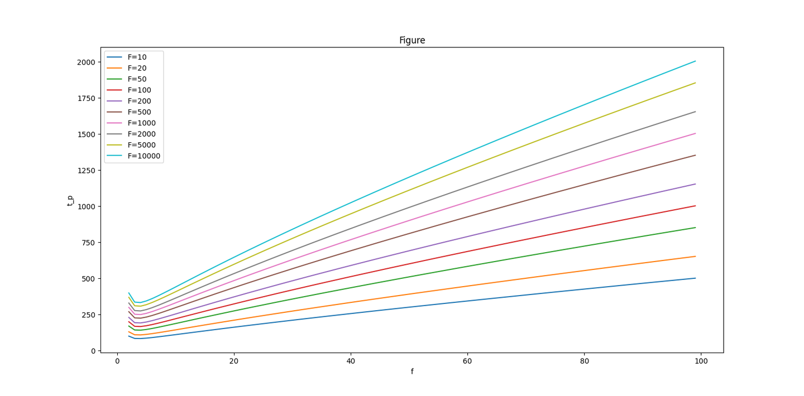

# 实验4（CS专业选学）反相器链
> “事物发展的根本原因，不是在事物的外部而是在事物的内部，在于事物内部的矛盾性。任何事物内部都有这种矛盾性，因此引起了事物的运动和发展。”
>
> ——《矛盾论》，毛泽东

在数字集成电路中，我们有时需要驱动一个大负载，常见的驱动大负载的电路结构就是反相器链。
## 4.1.反相器链的应用背景
对于数字集成电路（以下简称数集）来说，减小延时永远是一个热点话题，因为它意味着手机、电脑可以更快。那么反相器链就是一种为了提高速度（降低延时）的电路。有时，我们也称之为缓冲器，意思就是作为驱动外部大负载电路的缓冲电路。
## 引言例子
为了更好的理解反相器链的工作原理，我想了一个例子，也许不太准确，但是可以有个直观感受。

我们都玩过多米诺骨牌，有一种多米诺骨牌就是可以用一个很小的牌，通过逐渐增大逐级的牌的大小，最后可以推倒一个特别大的牌。

【3D虚拟 】以小搏大：示指发力，多米诺骨牌推倒巨型建筑_哔哩哔哩_bilibili
​www.bilibili.com/video/BV1XY4y1J7v8/?spm_id_from=333.337.search-card.all.click&vd_source=6bfabaab359566b9ea3ee9046cdb01cf

不过这里我们思考这样一个问题，**如何才能让这个多米诺骨牌传递的很快呢，也就是快速的推倒最后一个大的？**

显然，我们可以改变两个东西：一个是每一个多米诺骨牌**相对于前一级的放大系数**；另一个是**第一级和最后一级之间放置多少个多米诺骨牌**，或者是**第一级和最后一级之间插入多少个中间级**。

这里注意，其实这两个变量之间是有联系的：假设我们已知第一级和最后一级的牌大小，那么如果我们假设了每一级相对于前一级的放大系数都是一个常数，那么其实中间能插入多少个中间级也是被确定了；反之亦然。

举个例子，如下图，假设每一级均扩大f倍，总共有N级
???+ info "多米诺骨牌示意图"
    

如果第一级大小是1，最后一级大小是32，每次扩大系数均为2（f=2），那么中间就需要插入4级，总共6级（N=6）（大小分别是1，2，4，8，16，32）。

**所以记住放大系数和总级数是有一个关系的，后面我们会给出这个关系的数学表达式。换言之，在知道第一级和最后一级的大小的情况下（这个一定是已知的），我们如果计算出了每一级放大倍数，其实也就可以得到级数。**

现在，我们把这个多米诺骨牌的例子和反相器链对应起来：推倒一个多米诺骨牌就像是给下一个反相器的输入栅电容充电，多米诺骨牌一级一级推倒，就是反相器链一级一级给电容充放电。牌的放大倍数对应于反相器的放大倍数。多米诺骨牌的级数对应反相器链的级数。
???+ info "反相器链示意图"
    

这里有同学可能有这样的疑问：为什么每一级的扩大系数都一样？其实这只是我们假设的，理论上，你当然可以第一次放大10倍，第二次放大3倍。但是后面我们会证明：**只有当每一级之间放大的倍数均相等时，总体延时最小。**

## 建立延时模型并求最优解
为了可以继续我们的分析，定性的分析肯定不够了，所以我们需要建立一个关于延时的精准的数学模型，通过数学模型定量的分析，进而找到最优解。
我们的建模思路是：1、建立单个反相器的延时公式；2、建立反相器链的延时公式；3、对反相器链延时公式求导并使其为0，得到最小延时条件。
接下来每一个公式的具体推导在书本上都有详细的推导，我在这里仅解释这些公式的意义以及为什么这样推导。具体参考数字集成电路——电路、系统与设计（第二版）P136，P137
### 单个反相器的延时公式
根据书中的推导，对于单个反相器，其延时公式如下：

$$
t_p = t_{p0}(1+\frac{C_{ext}}{\gamma C_g})
$$

其中，$t_{p0}$是这个反相器的本征延时，一般是一个常数；$C_{ext}$代表外部的电容，其实就是这个反相器的输出负载电容，ext是external的缩写；$C_g$代表这个反相器的输入栅电容，一般也是常数；$\gamma$是比例系数，表示栅电容与本征输出电容之间的关系，目前对于大多数亚微米工艺，$\gamma$接近于1。

所以，把上面这个数学公式“翻译”一下：对于一个亚微米工艺的反相器，这个反相器的延时取决于它的外部负载电容与输入电容之间的比值。外部负载越大，延时越长，因为需要充电更长时间。

我们把$C_{ext}$和$C_g$的比值设为F，下面画出了随着F增大的反相器延时（以下分析均假设$\gamma$为1）：
???+ info "随着外部电容增加，延时也增加"
    

### 反相器链的延时公式
而对于一个在反相器链中的反相器，这个反相器输入栅电容就是本身的栅电容，输出负载电容其实是下一个反相器的输入栅电容。当然，除了最后一个反相器，它的负载就是最终的负载电容。

因此，反相器链中第j个反相器的延时就是：

$$
t_{p,j} = t_{p0}(1+\frac{C_{g,j+1}}{\gamma C_{g,j}})
$$

其实就是把外部负载电容替换为后一级的输入栅电容。

如果我们假设后一级比前一级反相器放大f倍，那么由于输入栅电容与面积呈线性关系，所以$\frac{C_{g,j+1}}{C_{g,j}} = f_j$，那么反相器链中第j个反相器的延时可以化简为：

$$
t_{p,j} = t_{p0}(1+\frac{C_{g,j+1}}{\gamma C_{g,j}}) = t_{p0}(1+\frac{f_j}{\gamma})
$$

我们再把这j个延时相加，就可以得到总的反相器链的延时：

$$
t_p = \sum_{j = 1}^{N}{t_{p,j}} = t_{p0}\sum_{j = 1}^{N}{(1+\frac{f_j}{\gamma})}
$$

至此，我们完成了一项很重要的工作，我们终于对反相器链的延时模型建立了模型，下面我们想一下，怎么才能让这个延时最短？

对，求导并使之等于0！

### 求导找到最优解
显然，反相器链的延时公式是一个有N-1个未知数，那么我们求N-1次偏导数，并都令其等于0，我们无法求解，但是可以得到一组约束条件：每一级反相器的放大倍数f都应该相同，也就是$f_1=f_2 ...=f_j...=f_N=f$。这里我们也会把这个放大系数，也就是一个反相器的输出负载电容与输入栅电容的比值f称为该级反相器的等效扇出。

这也解释了我们在引言中提出的那个问题：为什么我们要假设每一级放大倍数均相同。

再将这个结果带入之前的反相器链延时公式，得到：

$$
t_p = Nt_{p0}(1+\frac{f}{\gamma})
$$

但是这个延时公式和N以及f两个变量有关，能不能把这两个变量变成一个变量呢？

还记得之前让大家记住的放大系数f和总级数N是有一个关系的结论吗？现在我们推导它们之间的关系式。

其实这个关系式很明显了，假设最终负载电容和第一级的输入栅电容相差F倍，又因为每一级的放大倍数均相等，那么就是放大倍数f的N次方等于最终的负载电容，也就是f的N次方等于F。表达式用数学表示为：

$$
f^N = F\Rightarrow f = \sqrt[N]{F}
$$

其中F就是最终的负载电容和第一级反相器的输入栅电容的比值，称为反相器链总扇出。

**于是，延时公式就变为：**

$$
t_p = Nt_{p0}(1+\frac{\sqrt[N]{F}}{\gamma})
$$

这下，延时公式只与N有关了，我们再对其求导，并使其等于0，便可以得到最小延时时候的N，然后根据之前给出的关系，便可以再得到每一级的放大倍数f。求导得：

$$
\gamma + \sqrt[N]{F} - \frac{ \sqrt[N]{F} lnF}{N} = 0
$$

然而，很可惜，我们发现这是一个超越方程。如果要求解，只能一个一个带入值去尝试，但是幸运的是，**因为N代表反相器链级数，N一定是一个正整数**，所以我们的工作量小很多。这也是为什么我们把延时公式化为关于N的表达式，而不是关于f的表达式。
最后，我们依次带入N=1，2，3，...最终找到结果最接近0的N就可以解出反相器链级数N，进而得到放大倍数f。

## 来一道例题试一下
**题目：已知一个反相器链。反相器链第一级反相器为最小尺寸，传播延迟为70ps，Cin=10fF。负载电容CL=10pf。负载电容由下一级反相器栅电容组成。若反相器链的级数为N级。求反相器链的最小传播延时，以及此时的扇出系数f，级数N。**

首先我们通过题目可以知道：本征延时$t_{p0} = 70ps$,总扇出$F = \frac{C_{L}}{C_{in}}=1000$

然后，我们来通过公式找到最优的级数N，我们分别将N取1到9带入公式$\gamma + \sqrt[N]{F} - \frac{ \sqrt[N]{F} lnF}{N} = 0$中得到下面的结果：

|级数N|结果|
|:---:|:--:|
|1    |-5906|
|2    |-77|
|3    |-12|
|4    |-3|
|5    |-0.519|
|6    |0.521|
|7    |1.03|
|8    |1.32|
|9    |1.5|

从这个结果中，我们选择结果的绝对值最接近0的，那么就是N为5，接下来再只需要用f和N之间的关系式$f = \sqrt[N]{F}$就可以计算f了，所以$f = \sqrt[5]{1000} \approx 3.981$

最后根据延时公式计算总延时：$t_p = Nt_{p0}(1+\frac{\sqrt[N]{F}}{\gamma})=5\times 70 \times (1+\frac{3.981}{1})\approx1743ps$

### 最后总结一下做题的步骤：
1. 找到和计算本征延时tp0和总扇出F
2. 列出公式$\gamma + \sqrt[N]{F} - \frac{ \sqrt[N]{F} lnF}{N} = 0$
3. 分别取N为1，2，3...，直到找到使得表达式结果最接近0的N
4. 再通过公式$f = \sqrt[N]{F}$就可以计算扇出f
5. 最后通过公式$t_p = Nt_{p0}(1+\frac{\sqrt[N]{F}}{\gamma})$就可以计算总延时

## 是否可以得出一些快速使用普遍结论？
之前的分析比较麻烦。能否得到一些虽然不太准确，但是可以快速使用的近似模型？

一般来说，对于芯片设计师，我们其实更希望得到放大倍数f，因为真正在版图设计的时候，我们就是知道输入的栅电容和最终的负载电容，然后画出第一级之后每一级逐级放大f倍来完成版图设计。

我们下面分析这样的工程实际情况：我们已知第一级栅电容和最后的负载大电容的比值为F，我们看一下当F从10到10000之间（分别取F=10，20，50，100，200，500，1000，2000，5000，10000），随着放大系数f从1到100，延时的变化（假设本征延时t_p0为10）。

因此，我们不妨把上面延时关于级数N的关系式变化为延时关于f的关系式：

$$
t_p = t_{p0}\cdot log_fF \cdot (1+\frac{f}{\gamma})
$$

???+ info "随着f的增加，延时的变化。分别取F为10，20，50等"
    

看到，随着f增加，延时t_p首先下降，之后又上升，为了看的更清楚一些，我们只展示f在1到15之间的图像：
???+ info "取f在1到15之间的延时变化"
    

这时我们看到一个比较神奇的地方：即使F从10变化到10000，相差了3个数量级，最终延时也几乎都在放大倍数f取4左右的时候取得最小值！

因此，我们就可以得到一个快速的工程结论：一般我们均取放大倍数f为4。

## LTspice仿真实验验证
为了进一步验证理论结果，我使用方波作为输入信号，一组是只使用0.25um的单一反相器；另一组是有4级的反相器链，每一级之间的放大系数为4，同时驱动10pF的负载电容。
???+ info "测试电路图和结果"
    
    
可以看到，使用反相器链大幅度的增加了电路的驱动能力，但是芯片面积也大幅增加，甚至这里我们只是使用了4级反相器链，最后一级的宽度W就达到了16um，要知道这已经接近了大部分工厂0.25um工艺下最大的制造宽度！

实际上，在一个数字芯片中，有非常大的面积就是用作输出缓冲部分的反相器链，以及封装的引脚。

## 动手实践内容
1. 请自行设计一个驱动5pF电容的反相器链，使得输出延时最小
