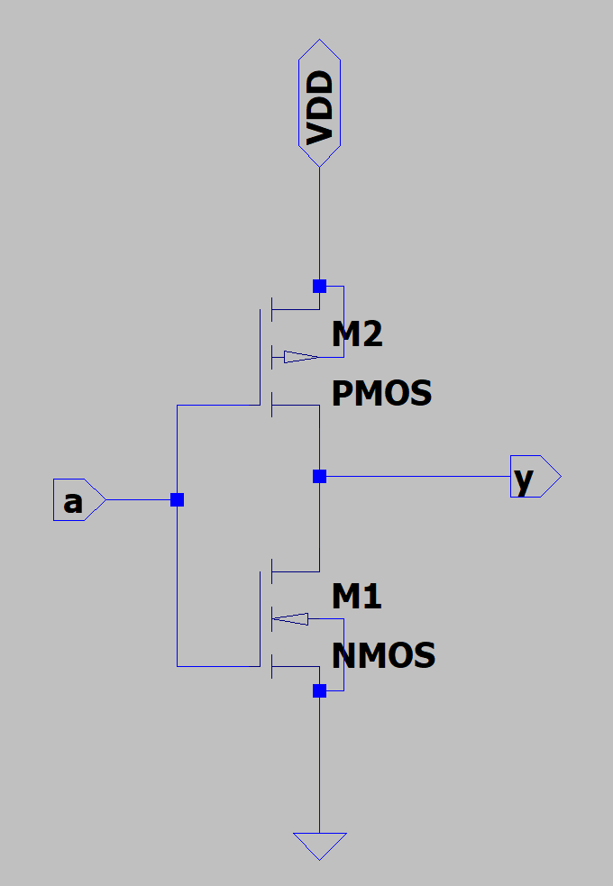
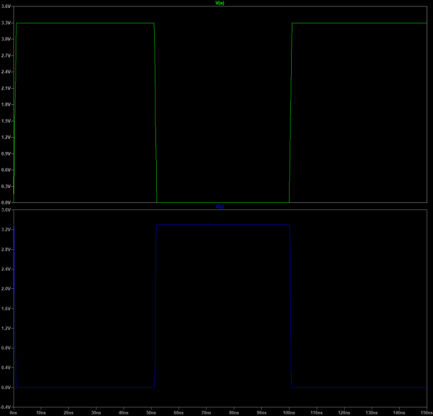
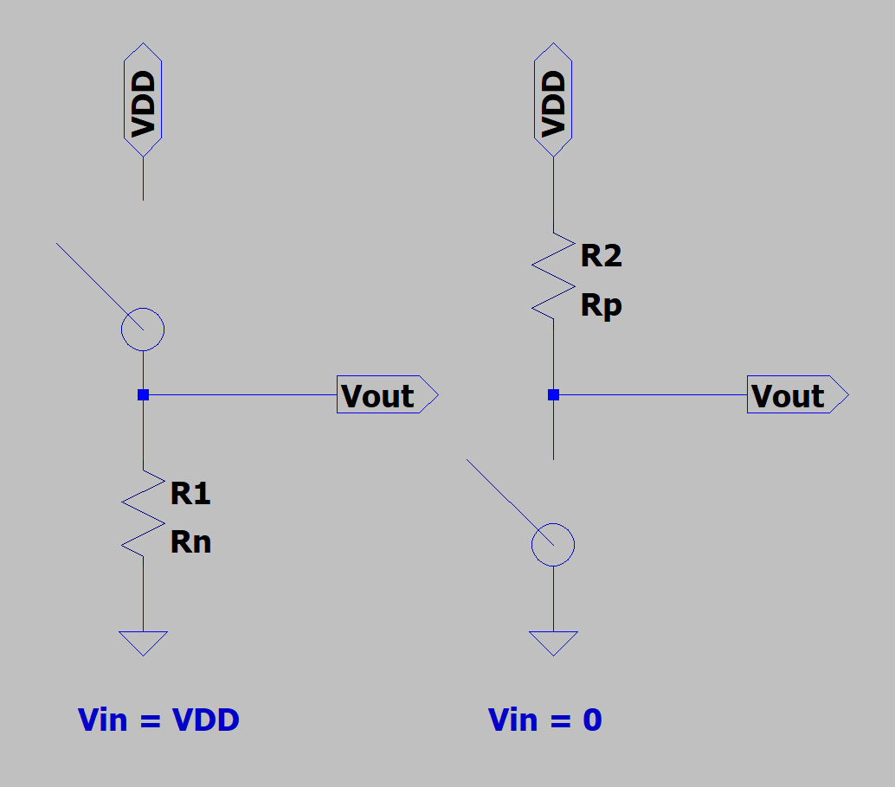

# 实验5 CMOS反相器（非门）
> “反者道之动；弱者道之用。”
>
> ——《道德经》，老子

经过前面对集成电路最基本的元器件——MOSFET的学习，相信同学们已经迫不及待想要进入到实际的电路设计部分了。

反相器，或者说非门，是数字设计的核心。反相器设计是一个最基本的入门实验，类似于C语言编程中的“Hello World实验”，通过反相器的设计，我们可以一窥数字集成电路设计的流程与特点。

## CMOS反相器电路设计
CMOS反相器由两个互补工作的MOS管组成，下图展示了CMOS反相器的电路图，其中的VDD表示电源电压，输入信号为a，输出信号为y。

???+ info "反相器原理图"
    

时域仿真的结果如下图所示：

???+ info "CMOS反相器输出结果"
    

其实我们可以使用MOS管的开关模型来直观的审视反相器电路的原理，如下图所示。可以看到，当输入信号为VDD时：NMOS导通，PMOS关断。因此可以看作是PMOS的开关断开，NMOS变成一个电阻（为何NMOS变成一个电阻？而不是一个导线呢？思考一下，稍后会解答）。此时，输出通过“化身为”电阻的NMOS连接到GND，所以输出电压为GND。
同理，当输入信号为0V时：NMOS关断，PMOS导通。因此可以看作是NMOS的开关断开，PMOS变成一个电阻。此时，输出通过“化身为”电阻的PMOS连接到VDD，所以输出电压为VDD。可以看到，通过互补的NMOS和PMOS，我们实现了对输入信号的反相，也就是说我们实现了一个数字电路中的非门！恭喜，我们成功解锁了数字电路的第一个门——非门。

???+ info "CMOS反相器的开关模型"
    

## 晶体管等效导通电阻
> 问题引入：为何NMOS或者PMOS导通时视作电阻而不是导线呢？

我们不妨回想一下晶体管器件基础部分中关于MOSFET静态特性的讲解，即使在导通的情况下，MOSFET源极与漏极之间的导通阻值依然很大（千欧姆量级）。这里我们给出晶体管导通等效电阻的具体计算公式：

$$
R_{eq} = \frac{1}{2} (\frac{VDD}{I_{DSAT}(1 + \lambda \cdot VDD)}) + \frac{VDD/2}{I_{DSAT}(1 + \lambda \cdot VDD/2)}) \approx \frac{3}{4} \frac{VDD}{I_{DSAT}} (1 - \frac{5}{6} \lambda  \cdot VDD)
$$

其中，$I_{DSAT}$代表饱和电流，VDD表示工作电压，表示沟道调制系数。
一个0.25um CMOS工艺的NMOS和PMOS晶体管在导通时的电阻取值如下表所示：
**表 1 0.25um CMOS工艺（沟道长度为最小）的NMOS和PMOS晶体管（W/L = 1）的等效电阻Req**

| VDD（V） | 1 | 1.5	| 2	|2.5 |
|:---------:|:---:|:--:|:--:|:--:|
| NMOS（kΩ）| 35  | 19 | 15 | 13 |
| PMOS（kΩ）| 115 | 55 | 38 | 31 |

仔细观察这个结果，我们可以提出一些问题：

> 问题1：此时MOSFET处于什么工作区（截止区，饱和区，线性电阻区）？

随着VDD电压（漏极和源极电源）的改变，电阻也随之改变，这是饱和区的特点，所以工作在饱和区。

> 问题2：为什么相同VDD条件下，PMOS的阻值比NMOS大？

最本质的原因是因为，PMOS是以空穴作为载流子，NMOS以电子作为载流子，空穴的迁移率比电子的迁移率低，所以导致在相同的电压下，PMOS的电流小。反映在宏观上，就是PMOS电阻大。请同学们自行查看BSIM模型的文档（APPENDIX A: Parameter List章节 A.2 DC Parameters），会发现在默认情况下：NMOS的迁移率为$670 cm^2/Vs$，而PMOS的迁移率则为$250 cm^2/Vs$。

## 故事时间：CMOS工艺
在微电子专业的保研面试中，经常出现的一道题就是：请你说一下CMOS工艺的英文以及中文含义。

CMOS工艺英文全称是Complementary Metal Oxide Semiconductor ，中文翻译为互补金属氧化物半导体。其中互补的含义就表示由NMOS和PMOS两个互补的器件来共同构成电路，例如在反相器中，我们就巧妙地利用了NMOS和PMOS互补的特性。

虽然这个互补的想法很符合我们的直觉，但是实际上，在20世纪70年代以及20世纪80年代早期，所有的早期处理器（例如大名鼎鼎的Intel4004）都是只用NMOS工艺实现的，因为当时的工艺缺少互补器件，这导致反相器会产生静态功耗（会带来功耗增加、发热等负面影响）。

直到20世纪80年代后期，当工艺技术缩小到允许更高集成密度时，工业界不得不转向CMOS。

## 构建自己的电路模块库
在我们构建大规模集成电路的时候，很多模块都会复用，这一点对于使用HDL语言的同学一定不会陌生（例如Verilog就是由一个一个module构成）。因此，我们一般会把反相器这样的基本单元进行封装，从而构建自己的电路模块库。

请同学们STFW，学习如何在LTspice中，将反相器封装为一个电路模型（**注意，使用我们自己定义的mynmos和mypmos模型！**）。并在其他文件中试着调用。

## 1.6.动手实验内容
1. 请仿真反相器的电压传输特性曲线（VTC），即展示Vout和Vin之间的关系。
提示：使用LTspice的dc扫描功能。
2. 并想想曲线不同部分NMOS和PMOS分别处于什么工作区。（需要半导体物理与器件等相关知识）
3. 试着改变我们定义的MOSFET中的各个参数，观察变化后的实验结果。并从半导体物理的角度解释为什么。