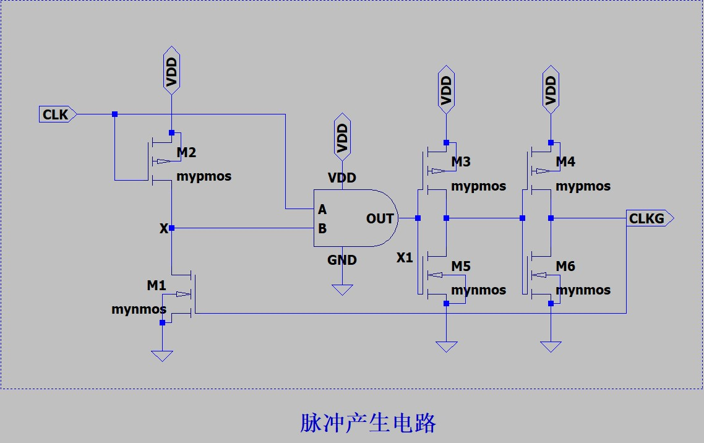

# 实验7时序逻辑电路设计
> “待把相思灯下诉，一缕新欢，旧恨千千缕。最是人间留不住，朱颜辞镜花辞树。”
>
> ——《蝶恋花·阅尽天涯离别苦》，王国维

时序逻辑是可以保存状态信息的电路，时序电路的输出不仅由当前输入值决定，还取决于原先输入的值，也就是说时序电路具有记忆功能。本实验将搭建一些时序逻辑的基本模块，即锁存器和寄存器。
## 7.1.时序电路的时间参数
### 7.1.1.建立时间$t_{su}$
建立时间是指，在时钟信号的有效边沿到来之前，数据信号必须保持稳定的最小时间。比如，我们希望最少在时钟信号正边沿到来的30ns前，数据信号保持稳定，那么30ns就是这个电路的建立时间。
### 7.1.2.维持时间$t_{hold}$
维持时间是指，时钟信号的有效边沿之后数据输入仍然必须保持稳定的时间。可能有很多同学奇怪，为什么时钟信号的有效边沿之后，数据还要保持不变？
这是因为，我们的电路在“采样”这个输入数据的时候，由于内部的一些寄生电容，导致这个采样信号需要一定的时间才能被稳定的“采样”到电路内部，因此，我们希望在时钟边沿之后数据信号也保持一定的时间。
上面两个时间约束合起来，就解释了为什么我们经常希望时钟的有效边沿在数据变化的中间，因为当时钟边沿在数据变化的中间时，最大程度保证了建立时间和维持时间的成立。
这也就是为什么我们上一节实验中的动态逻辑门，要把CLK信号延迟12.5ns，因为延迟之后，CLK的边沿正好处于数据信号变化的正中间。而当我们取消这个延时之后，就会发现结果不对了，这就是因为没有满足建立时间：时钟边沿到来的同时，数据信号发生了变化，建立时间为0。
这么描述大家肯定很模糊，下面这个图可以让大家很好的理解这两个时间参数的关系。
???+ info "建立时间和保持时间的关系"
    
### 7.1.3.传播延时$t_{c-q}$
传播延时表示，最坏情况下，从时钟边沿开始，经过了多长时间，数据输出到了输出端Q。
## 7.2.静态锁存器和寄存器
静态时序逻辑的基本原理是利用两个反相器串联构成一个正反馈，从而建立双稳态电路。也就是说，这个电路的输出在经过两个反相器串联的环路后，一定会稳定在0或者1（不考虑恰好处于正中间的亚稳态工作点）。
### 7.2.1.多路开关型锁存器
传输门多路开关时建立一个锁存器最稳妥和最常用的技术。下面分别表示了负锁存器和正锁存器的原理。对于负锁存器，当时钟信号为0，输出Q选择输入端0，输入端0就是数据信号D，也就是说输出Q“跟随”输入D；当时钟信号为1时，输出Q选择输入端1，输入端1连接了输出Q，因此保持之前的状态。也就是说，负锁存器当CLK=0时，Q=D，当CLK=1时，Q=Q*（Q*表示上一个状态的Q值）。正锁存器的原理正好相反，请读者自行分析。
???+ info "正锁存器和负锁存器"
    
    

实现这个双路复选器（MUX）的方法有很多，我们这里给出利用传输门构成的方法（上一个实验的选学内容中已经介绍过传输门逻辑），以及最终的仿真结果。可以看到，在CLK=VDD时，输出Q跟随输入D，当CLK=0时，输出Q保持不变。
???+ info "传输门构成的多路开关型正锁存器"
    
    

### 7.2.2.主从边沿触发寄存器
构建一个边沿触发器的最普遍方法时采用主从结构。其基本原理是，由两个互补的锁存器串联（例如一个负锁存器和一个正锁存器串联），那么当CLK=0时，负锁存器将输入信号D输出到中间节点，此时正锁存器处于维持状态，输入信号被“暂存”到中间节点，随后，当CLK=1时，正锁存器将这个中间节点的数据输出到Q，从而实现了主从正边沿触发寄存器。请读者自行思考如何实现一个主从负边沿触发寄存器。
下面我们给出电路原理图和仿真结果：
???+ info "主从边沿触发寄存器"
    
    

## 7.3.动态锁存器和寄存器
虽然静态时序逻辑比较稳定，但是正如我们所见，它的电路建构比较复杂。正如在组合逻辑中使用动态组合逻辑门的思路一样，利用电荷以及寄生电容，我们在时序逻辑中也可以构建动态时序逻辑门。
### 7.3.1.动态传输门边沿触发寄存器
下面是一个基于主从结构的动态正边沿触发寄存器。当CLK=0时，第一个传输门导通，第二个传输门关断，数据输入到中间节点，电荷存储在中间节点的电容上，当CLK=1时，第一个传输门导通关断，第二个传输门导通，数据输出到Q。请读者思考这里电路中2个反相器的作用是什么，试着把它们去掉后，观察实验结果。
???+ info "动态传输门边沿触发寄存器"
    
    

这种结构实现边沿触发器是十分高效的，它只需要8个晶体管，而之前的结构则需要20个！
### 7.3.2.真单相正边沿触发寄存器
但是之前的电路中，总是需要互补的时钟信号来驱动传输门，我们是否可以只使用单一时钟信号呢？真单相钟控寄存器（TSPCR）提供了一种只使用单一时钟信号的方法。以下是该电路的电路图和结果。
需要我们特别注意的是，TSPCR中晶体管的尺寸会严重影响功能是否可以正确实现。如果你直接使用默认的晶体管尺寸，你会发现功能并不正确，这里需要注意：TSPCR中晶体管的尺寸是实现正确功能的关键。
请你解释原因，并设计合适的晶体管尺寸，保证功能的正常实现，这里我只是增大了M5和M9尺寸，使得功能可以正常实现，即便如此，我们仍然可以观察到输出结果在某些地方并不理想。
???+ info "真单相正边沿触发寄存器"
    
    

## 7.4.*脉冲寄存器
还有一种非常有意思的寄存器实现方法就是脉冲寄存器。脉冲寄存器的基本思想是：对于一个高电平锁存器，如果在时钟上升沿处产生一个非常短时间的脉冲，那么此时锁存器就会把锁存住这个短时间时候的值。只要脉冲时间足够短，我们就可以认为输出就是上升沿瞬间的输入。

首先我们先解决第一个问题：如何产生一个脉冲呢？
### 脉冲产生电路
下面我们给出脉冲产生电路的原理图：
???+ info "脉冲产生电路的原理图"
    

我们来分析一下这个电路的原理：
1. 首先，在输入时钟CLK为低电平的时候，PMOS M2导通，节点X为高电平，但是由于与门A输入为低电平，所以与门输出还是低电平，经过两个反相器后，脉冲输出CLKG依旧是低电平。
2. 然后，在输入时钟CLK变为高电平的时候，PMOS M2关断，由于寄生电容，节点X仍然暂时保持在高电平，此时与门的两个输入端均为高电平，所以输出为高电平，最终的脉冲输出CLKG为高电平。
3. 最后，由于脉冲输出CLKG为高电平，NMOS M1导通，节点X被下拉为低电平，与门输出变为低电平，再经过2个反相器后输出脉冲也为低电平。

> 想一想：输出脉冲的脉冲宽度由谁来决定？

要回答这个问题，我们只需观察从脉冲输出高电平到变为低电平有哪些传播延时。
1. CLKG为高电平，M1导通将X节点下拉到低电平的延时
2. 低电平从与门的B输入传播到与门的输出延时
3. 与门输出的低电平经过2个反相器的传播延时

所以我们可以通过改变与门以及2个反相器的传播延时来调整脉冲宽度，至于怎么改变传播延时，想必大家都已经烂熟于心了。

## 7.5.动手实验内容
1. 测试一个电路的建立时间、维持时间和传播延时
2. 设计一个带异步置位和复位功能的锁存器和寄存器
3. 设计一个负边沿触发的寄存器
4. 静态SR触发器
5. 设计一个双边沿触发器