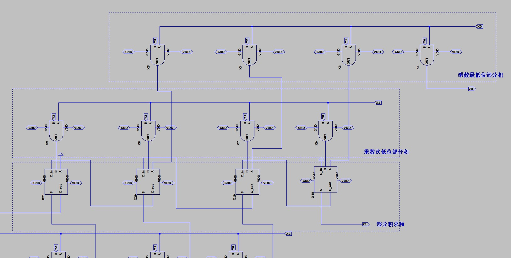

# 实验8 全加器与移位器
> “If an a-machine prints two kinds of symbols, of which the first kind (called figures) consists entirely of 0 and 1 (the others being called symbols of the second kind), then the machine will be called a computing machine.”
> （“如果一个a机器可以输出两种类型的符号，其中第一种（称为数字）仅由0和1组成（第二种称为符号），那么这个机器可以被称为计算机器。”）

> ——《On computable numbers, with an application to the Entscheidungsproblem》，A. M. Turing

在我们设计了诸如与或非门等基本组合逻辑单元以及锁存器和寄存器等时序逻辑单元后，我们可以将我们的目标，放到构建更大的模块上。ALU是CPU中的基本单元，通过本节实验，我们将使用晶体管搭建一个全加器。
## 8.1.全加器
全加器的原理我们再次不过多介绍。我们可以直接将标准的表达式变为互补的CMOS电路。但是， 我们可以进行某些逻辑变换，从而减少晶体管的数目。例如，我们在“和”与“进位产生”的子电路之间共享某些逻辑非常有利，这里我们写出经过变化后的全加器的表达式（共享了反相C_out）：

$$C_{out} = AB + AC_{in} + BC_{in}$$

$$S = ABC_{in} + C_{out}'(A + B + C_{in})$$

???+ info "全加器电路图和实验结果"
    
    

## 8.2.移位器
### 8.2.1.筒形移位器
筒形移位器由一个晶体管（传输门）阵列组成。其行数等于数据的字长，而列数等于最大的以为宽度。我们这里给出了一个可控制向右移动，移动宽度位0至3的桶形移位器，数据的字长为4。其中，Ax表示输入数据，Bx表示输出数据，Shx表示向右移动x位，使用独热码编码，例如当我们希望右移2位时，Sh3：Sh0等于0100。尤其可见，我们需要配合使用一个译码器电路，将二进制编码转化为独热码（编码器在数字电路课程中讲解过，此处不再赘述）。下面为电路图和实验结果，A3：A0为1010（1表示高电平VDD，0表示低电平GND），可以看到输出的B3：B0为1110，这说明该移位器最高位由原来的符号位补位，也说明实现了二进制补码移位。

???+ info "筒形移位器电路图和实验结果"
    
    

### 8.2.2.对数移位器
对数移位器采用分级的方法。总的移位值被分解成为几个2的指数值，因此对数移位器的输入控制字已经是二进制编码（编码信息体现在电路的连接方式中），所以无需单独的译码器。

下面我们展示了一个2位控制字（可以提供0至3位移位宽度）的右移对数移位器，输入信号A3：A0为1010，向右移位2位（输入编码Sh2:Sh1为10）。

???+ info "对数移位器电路图和实验结果"
    
    

一般来说，筒形移位器适用于较小的移位值，对于较大的移位值，对数移位器在面积和速度方面更有优势。而且对数移位器很容易参数化，便于自动化生成。

## 乘法器
乘法器的设计一直是数字集成电路的热点，有各种各样的结构被提出，期望使用更少的面积来实现乘法器。尤其是人工智能的快速发展，乘累加（MAC）结构被大量的使用。

这里我们仅介绍一种最简单的阵列乘法器结构，关于乘法器的更多内容，大家可以搜索相关的论文进行了解。这里的乘法器借鉴了我们手算乘法的过程，回想一下，我们手动计算乘法时，首先从乘数的最低位开始，依次乘以被乘数，再将这些部分积进行累加。下图将这个思路映射到了具体电路实现。这里注意，对于二进制来说，乘法其实就是两个数做与运算。

???+ info "乘法器思想展示"
    

按照上面的思路，我们将电路拓展到4位运算
???+ info "乘法器完整电路图"
    

```
输入
X = 1101(13)
Y = 1110(14)
输出
Z = 1011_0110(182)
```

由于结果Z是8位，直接使用图片展示效果不好，我们使用spice命令直接测量10ns时8位的输出电压。至于怎么使用spice命令测量特定时间的电压值，请大家STFW。最终的输出报告如下：

```
z7: v(z7)=2.5 at 1e-08
z6: v(z6)=2.86373e-08 at 1e-08
z5: v(z5)=2.5 at 1e-08
z4: v(z4)=2.5 at 1e-08
z3: v(z3)=2.86375e-08 at 1e-08
z2: v(z2)=2.5 at 1e-08
z1: v(z1)=2.5 at 1e-08
z0: v(z0)=2.86372e-08 at 1e-08
```

转化为二进制就是Z = 1011_0110，与我们预期相符

## 8.3.动手实验内容
1. 自己实现筒形移位器的左移功能
2. 实现一个8位的最大移位宽度位右移7位的对数移位器
3. 设计右移自动补位为1或者0的对数移位器