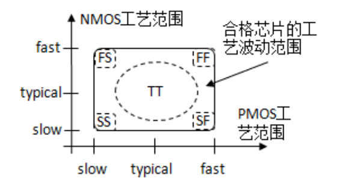
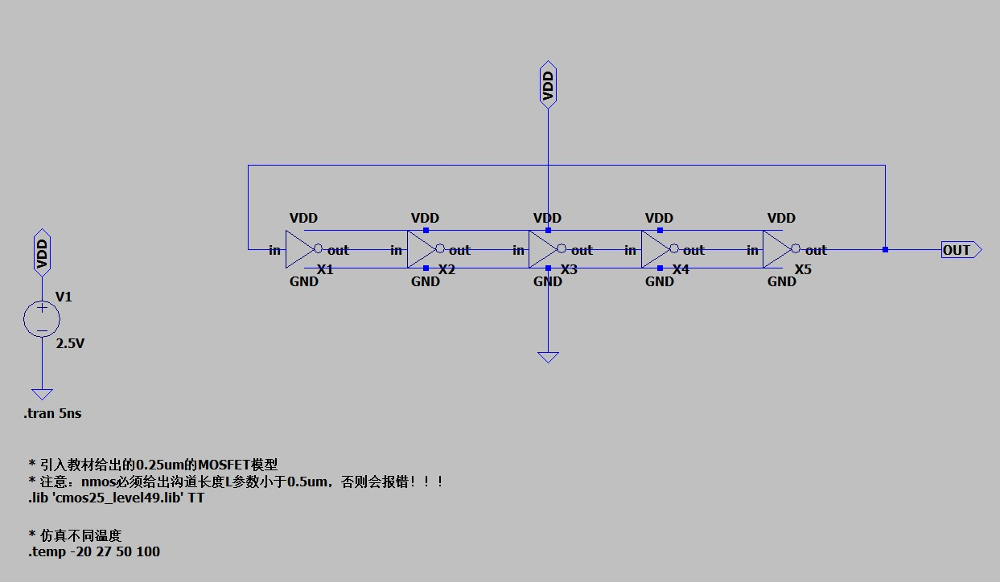
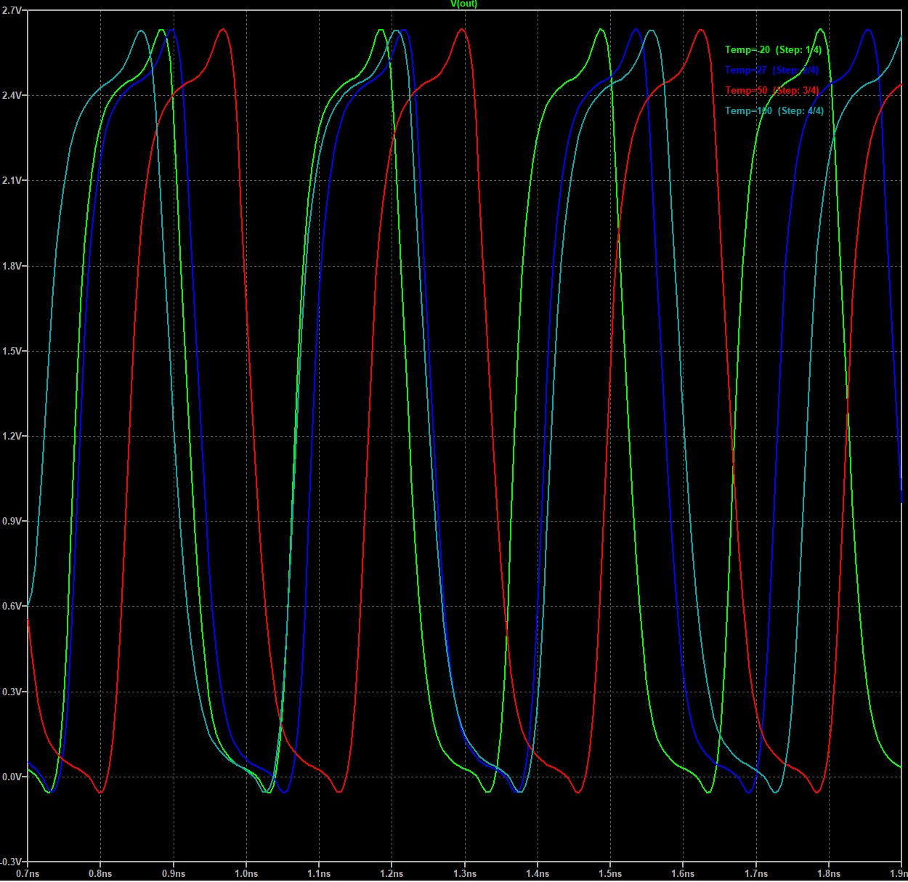

# 工艺角，PVT以及环形振荡器
> “XXXXX”
>
> ——xxxXXX

我们集成电路专业与计算机专业同学的一个却别就在于，我们需要考虑实际芯片生产中的物理约束和“缺陷”情况，比如不同芯片工厂生产工艺的差异，芯片工作的环境温度变化等等，这就是我们常说的PVT（工艺Process，电压Voltage，温度Temperature）。

## 5.1.工艺角
世界上没有两片完全相同的叶子，任何一个半导体工厂都不能保证生产的芯片中每一个晶体管都是一模一样的，而这些由工厂工艺差异导致的性能差异，我们就称为工艺角。不妨让我们先通过几道题测试一下你的半导体物理学的怎么样：
1. MOSFET的栅氧厚度减小，晶体管的速度更快还是更慢？
2. MOSFET的沟道宽度增大？
3. 供电电压VDD减小？
4. 温度增加？

如果上面的几道题你都没有回答出来的话，那你可要赶紧复习一下半导体物理啦！
影响晶体管的工艺有很多，但是最终都会体现在晶体管的速度上，比如由于工艺差异，栅厚度减小，那么就会增加栅极对沟道电流的控制能力，进而可以提高晶体管的速度，所以这个晶体管的速度就比平均值高，反之亦然。下图展示了5种工艺角，它们分别是（TT：Typical NMOS Typical PMOS 典型NMOS 典型PMOS，FS: Fast NMOS Slow PMOS 快NMOS 慢PMOS，FF, SS, SF）
???+ info "工艺角"
    
还记得我们引入的模型中最后有一个TT吗？现在大家知道这个代表什么意思了吧。在后面的实验中，我们均使用TT工艺角进行仿真。
## 5.2.PVT
上面已经介绍了PVT（工艺Process，电压Voltage，温度Temperature），工艺体现在工艺角上，电压体现在内部的电平切换或者外部干扰，导致供电电压VDD在一定范围内波动。一般来说，电压越高，电流越大，速度越快，但是功率也会随之升高。温度则会通过影响迁移率来影响速度。
在实际的生产中，我们一定要确保在不同的PVT下，我们设计的芯片都可以正常工作才可以，尤其当温度大范围变化时，芯片的情况会发生非常大的变化！
## 5.3.环形振荡器
通常，学术界和业界会通过一个环形振荡器的结构来测试一个新工艺，环形振荡器其实就是奇数个反相器首位相连的结构，显然，这是一个正反馈结构，所以一定会发生震荡，我们可以通过最终输出的震荡频率来测试某一种工艺。
下面我们使用5个反相器构成环形振荡器，并分别测试在TT工艺角下不同温度的振荡频率。
???+ info "环形振荡器原理图"
    
结果如下
???+ info "环形振荡器结果"
    
可以看到不同温度下，结果不同，这样看有些不能明显的看出频率。请同学们自行STFW，学习如何测量一个信号的频率。下面我给出具体的结果。
| 工艺角 | TT | FF	| SS |
|:-----:|:--:|:---:|:---:|
| 频率   | 3.53GHz  | 3.89GHz | 3.17GHz |

| 温度 | -20 | 27	| 50 | 100 |
|:-----:|:--:|:---:|:---:|:---:|
| 频率   | 3.75GHz  | 3.49GHz | 3.42GHz | 3.21GHz |
最终的结果表明：当工艺角为FF时，频率最高，SS最低，温度越高频率越低，这也就是我们总是希望给CPU降温的原因之一。
## 5.4.动手实验内容
1. 请思考如何仿真SS，FF等工艺角
2. 请RTFSC，并了解模型是如何改变TT,SS,FF等工艺角的结果的