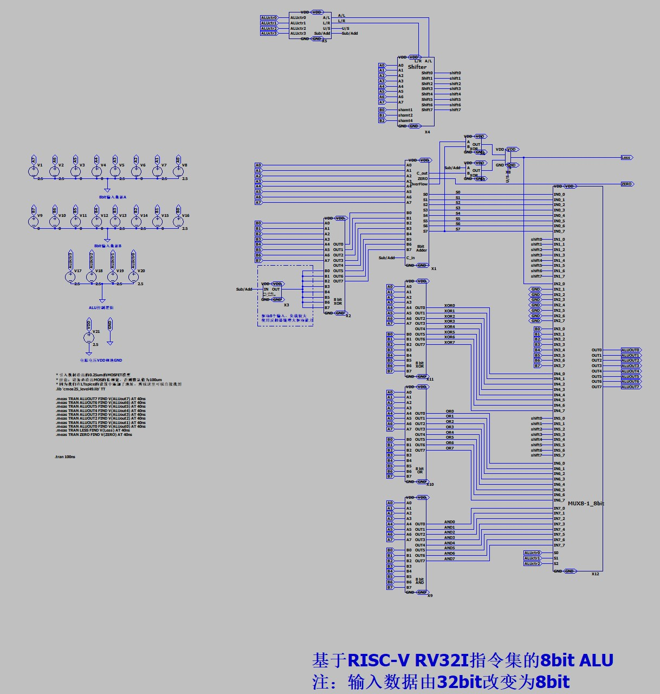

# "毕业"设计_8bit_ALU

> 
> 
> 

## 8bit ALU设计
我们数字集成电路的旅程在这里就要告一段落了，我们从最简单的仅需2个晶体管的非门开始，介绍了数字集成电路的评价指标，设计方法。之后我们设计了许多基本门电路，比如与门，或门等等。然后我们进入时序逻辑的设计，讲解了锁存器和寄存器等电路的构造方法。最后我们向着更高层次的运算功能模块进发，介绍了全加器，乘法器，移位器等电路。

最后，我想通过一个实际的项目来为我们的旅程做一个完美的结束，最后我想通过设计一个8bit的ALU再合适不过了。这里我们的参考资料是[**南京大学 计算机科学与技术系 数字逻辑与计算机组成 课程实验**](https://nju-projectn.github.io/dlco-lecture-note/index.html)，其中**实验十 CPU数据通路**详细的介绍了基于RISC-V的基础版本CPU RV32I的ALU设计。只不过由于我们是手工搭建电路，32bit的工程量过大，所以精简为8bit数据输入，但是原理和操作一模一样。

本次实验完全作为对大家的测试，请大家按照南京大学讲义自行设计所需的各基本模块并完成最终的设计。

这里我仅展示我设计的最终原理图：

???+ info "8bit_ALU最终原理图"
    
